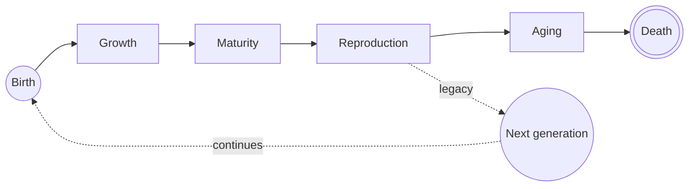
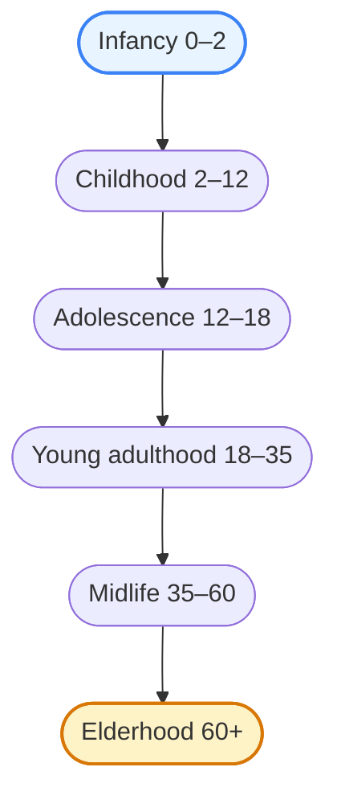
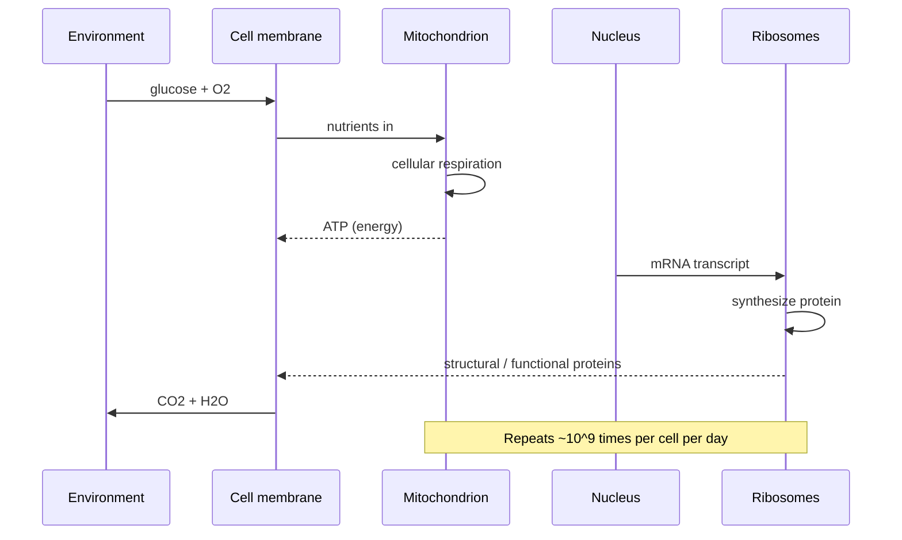
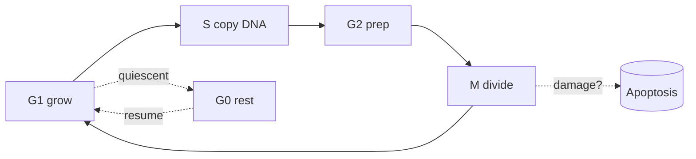
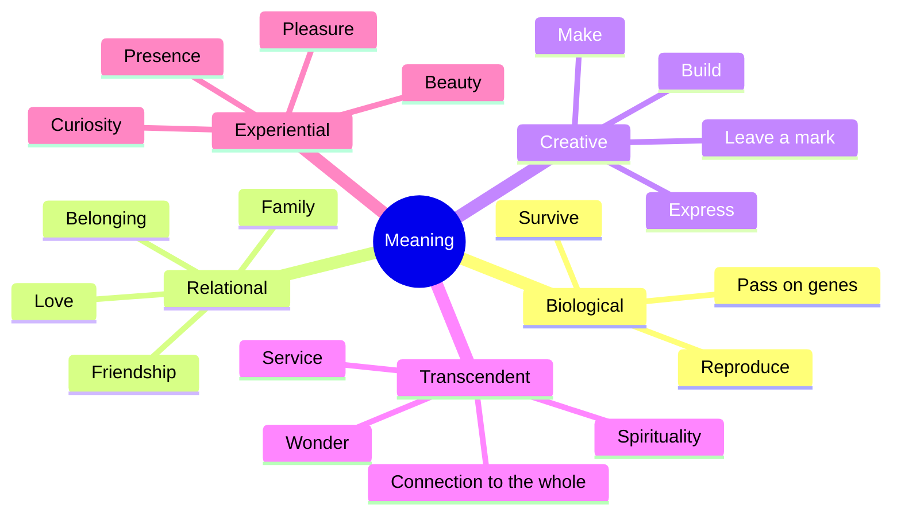
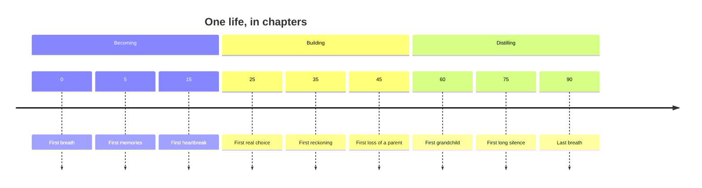
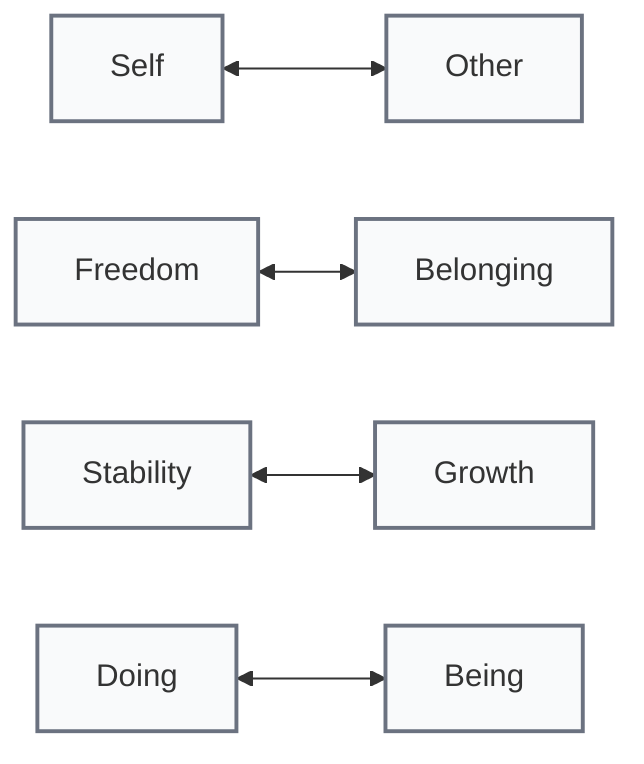

# Life

A visual essay on what it is, how it moves, and what it might mean.

---

## What we'll cover

- The arc — a life cycle, in shapes
- The stages — childhood to elder
- The engine — a single cell, working
- The question — what is it all *for*?

---

## The arc

A loop, not a line. Death feeds the next beginning.

---

## Stages of a life

Each stage hands the next one a different question to answer.

---

## What each stage is *doing*

- **Infancy** — build the body, attach to caregivers
- **Childhood** — absorb language, world, rules
- **Adolescence** — separate, individuate, take risks
- **Young adult** — commit, build, mate, work
- **Midlife** — reassess, narrow, deepen
- **Elder** — integrate, transmit, let go

---

## Inside one cell

A whole economy, running silently, in something smaller than a dust mote.

---

## The cellular cycle

Grow. Copy. Check. Divide. Or — quietly stop, if something is wrong.

---

## What is life *for*?

No single answer. Multiple, layered, all real.

---

## A timeline of a human life

The dates are placeholders. The shape is universal.

---

## Tensions we live inside

A life is the ongoing negotiation between these poles. None of them "win."

---

## So what

- Life is a **cycle**, not a destination
- Stages are not goals — they are **vantage points**
- The engine is **cellular, relentless, miraculous**
- Meaning is **plural** — you don't pick one, you weave several
- The interesting question is not *what is life* but *what are you doing with this one*

---

## Closing

> "Tell me, what is it you plan to do
> with your one wild and precious life?"
> — Mary Oliver

Thanks.
