# Claude Code and Its Ecosystem

A concrete tour of the moving parts: agents, MCP, hooks, skills, RAG, and memory — and how they compose.

> For developers familiar with general LLM tooling, new to Claude Code.

---

## What this deck covers

1. Claude Code overview
2. MCP (Model Context Protocol)
3. Agents and subagents
4. Agent teams (orchestrator + workers)
5. Hooks
6. Skills
7. RAG (retrieval-augmented generation)
8. Memory system
9. Putting it all together

Each concept has at least one Mermaid diagram. Eight different diagram types appear across the deck.

---

# 1. Claude Code overview

---

## What Claude Code is

- A coding agent built around the Claude model family (Opus, Sonnet, Haiku).
- Runs in multiple surfaces: terminal CLI, IDE extensions (VS Code, JetBrains), Claude Desktop, and the web app.
- Has direct access to your filesystem, shell, and editor — not a chat box pretending to code.
- Same model, same tools, same harness behavior across all surfaces.
- The CLI is the canonical surface; everything else is a thin shell around the same agent loop.

---

## High-level architecture

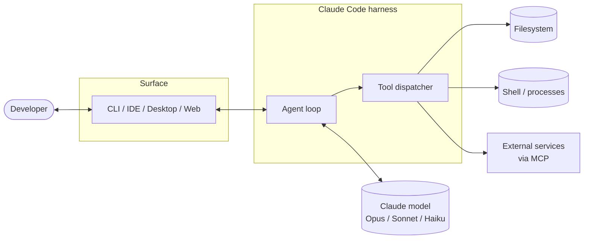

The agent loop is the same regardless of surface; the surface only handles I/O.

---

# 2. MCP — Model Context Protocol

---

## What MCP is

- An **open protocol** for giving an LLM agent access to external tools and data.
- An MCP **server** advertises a set of tools (JSON-RPC over stdio or HTTP).
- Claude Code is an MCP **client**: it discovers servers configured in `settings.json`, lists their tools, and lets the model call them.
- Same shape as built-in tools (Read, Edit, Bash) — the model doesn't know the difference.
- Common servers: GitHub, Slack, Google Drive, Postgres, custom internal APIs.

---

## MCP call sequence

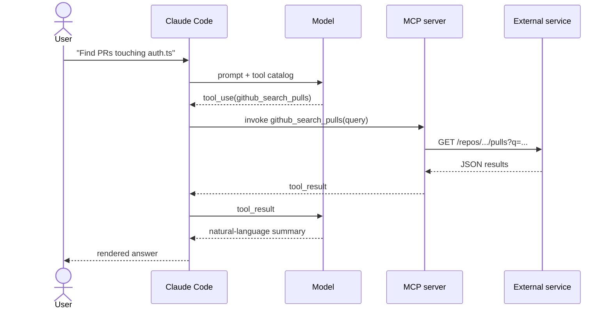

Servers are processes the harness spawns; tool calls are JSON-RPC messages.

---

# 3. Agents and subagents

---

## The Task tool

- Claude Code can spawn **subagents** through the `Task` tool.
- A subagent is a separate model invocation with:
  - its own system prompt and tool allowlist,
  - a fresh context window,
  - a defined exit (a final assistant message returned to the parent).
- Common built-in agent types:
  - **Explore** — locate code, read files, return findings as text.
  - **Plan** — produce a step-by-step plan without writing.
  - **general-purpose** — open-ended; can write code and run commands.
- Custom subagent types are defined as markdown files with frontmatter (tools, model, system prompt).

---

## Parallel vs sequential dispatch

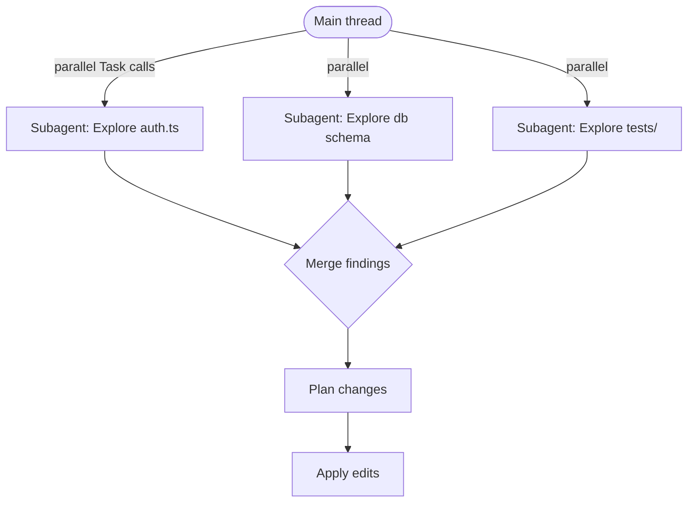

Parallel dispatch is the lever for cutting wall-clock time when subtasks are independent.

---

## Why subagents at all?

- **Context isolation.** A 200k-token Explore doesn't pollute the main thread's window.
- **Specialization.** A reviewer agent sees only the diff; a builder agent only the relevant files.
- **Output compression.** The subagent's transcript stays in its own context; only the final message lands in the parent.
- **Composability.** Subagents can themselves dispatch (bounded depth — usually 1 or 2 levels).

The tradeoff: each subagent is a fresh model call with its own startup overhead. Don't dispatch for one-line tasks.

---

# 4. Agent teams (cavecrew / multi-agent)

---

## The orchestrator pattern

- Main thread acts as **orchestrator**: decides which specialist to call and stitches results.
- Specialists are subagent types with narrow scope:
  - **Investigator** — read-only; locates code, surfaces facts.
  - **Builder** — edits 1–2 files within a known scope.
  - **Reviewer** — sees a diff, returns a verdict.
- Each specialist's output is a short, structured artifact the orchestrator can re-inject as input to the next.
- This is the same pattern Claude Code's `ai-docs` plugin uses (orchestrator + `ai-docs-builder` subagent).

---

## Roles and handoffs

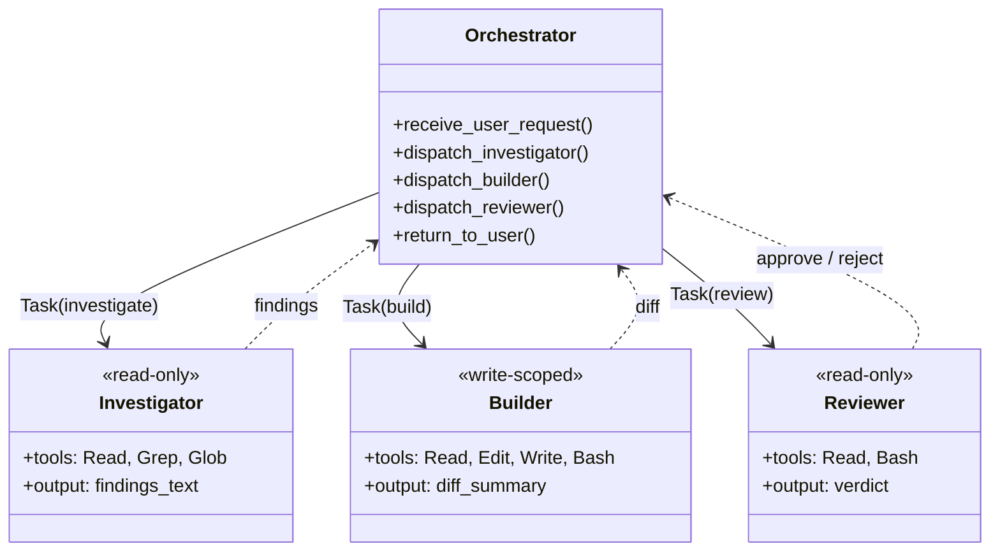

Specialists never talk to each other; the orchestrator is the only routing point.

---

# 5. Hooks

---

## What hooks are

- **Shell commands** the harness runs at fixed lifecycle points around the agent loop.
- Configured in `settings.json` — declarative, not in-prompt.
- The harness (not the model) executes hooks, so they fire deterministically.
- They can **inject context** (stdout becomes a system message) or **block** an action (non-zero exit on PreToolUse).

| Hook | Fires |
|---|---|
| `SessionStart` | New session begins |
| `UserPromptSubmit` | Before each user turn |
| `PreToolUse` | Before a tool call (can deny) |
| `PostToolUse` | After a tool call returns |
| `Stop` | Agent finishes responding |

---

## A tool call with hooks around it

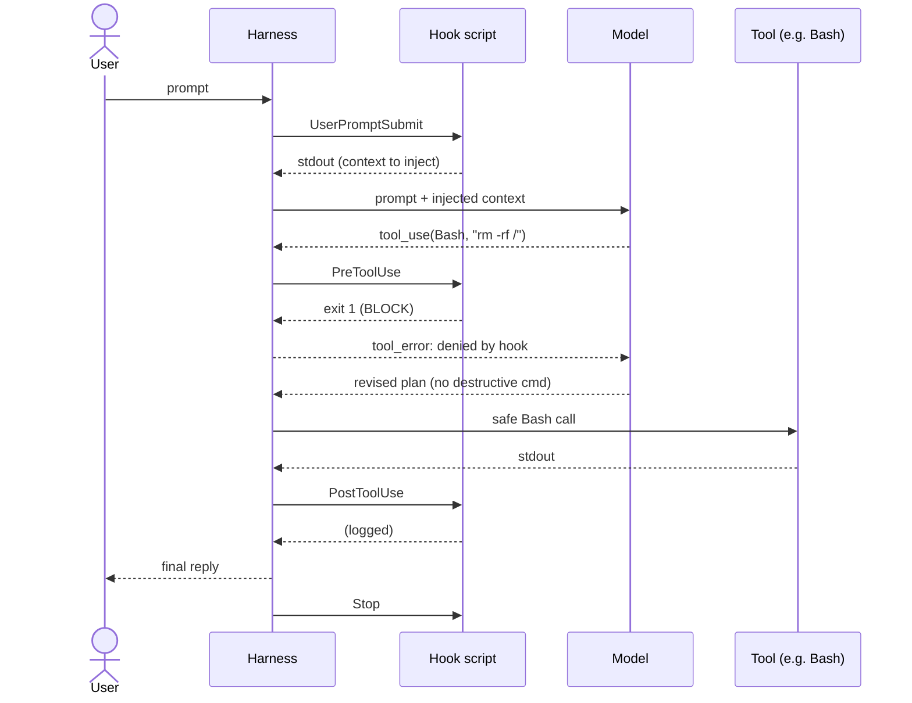

PreToolUse blocking is the typical safety lever; PostToolUse is the typical logging lever.

---

# 6. Skills

---

## What skills are

- Self-contained **capability bundles** stored as markdown + optional scripts.
- Each skill has a `name`, a `description`, and a body of instructions.
- The harness exposes skill metadata to the model. When a user request matches a skill's triggers, the model calls the **`Skill` tool** to load it.
- Once loaded, the skill's full body enters context as instructions the model follows.
- Skills can ship **scripts** (bash, python) the model invokes via Bash.
- Plugins (like `ai-docs`, `caveman`, `example-skills`) bundle multiple skills under a namespace.

---

## Discovery → invocation → execution

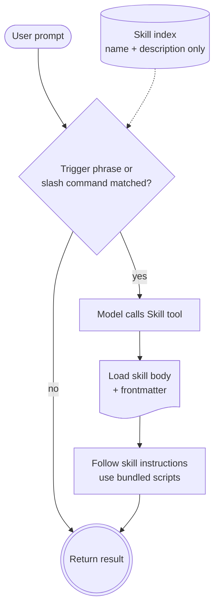

Only metadata sits in context permanently; the body loads on demand. This keeps the always-on cost low while making many capabilities available.

---

# 7. RAG — retrieval-augmented generation

---

## RAG in a Claude Code context

- Most useful when the project is too large to fit in context (codebase, docs corpus, long-running logs).
- Two-phase pipeline:
  1. **Indexing** (offline): chunk documents → embed each chunk → store vectors + metadata.
  2. **Query time** (per request): embed the query → similarity-search the store → inject top-k chunks into the prompt.
- The retrieval store is typically exposed to Claude Code through an **MCP server** (vector DB, doc search, repo grep).
- RAG is complementary to subagent-based exploration: subagents can navigate code structurally; RAG returns semantically similar passages.

---

## RAG pipeline

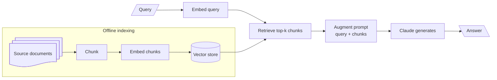

Quality is dominated by chunking strategy and embedding model choice, not by the LLM step.

---

# 8. Memory system

---

## File-based, not vector-based

- Claude Code's memory is **plain markdown files** the harness loads at session start (or on demand).
- Common kinds:
  - **User memory** (`~/.claude/CLAUDE.md`) — global preferences, never project-scoped.
  - **Project memory** (`./CLAUDE.md`) — facts about this repo.
  - **Feedback memory** — accumulated corrections from past sessions.
  - **Reference memory** — long-lived notes (`~/.claude/memory/refs/...`).
- Memory is **human-readable** — you can `cat` it, edit it, version it.
- The harness's `SessionStart` hook is usually where memory gets injected.

---

## Memory write/read across sessions

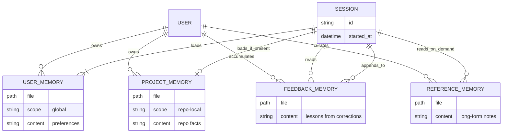

Because memory is a file, it's diffable, syncable, and easy to inspect. No hidden state.

---

## Memory lifecycle as a state machine

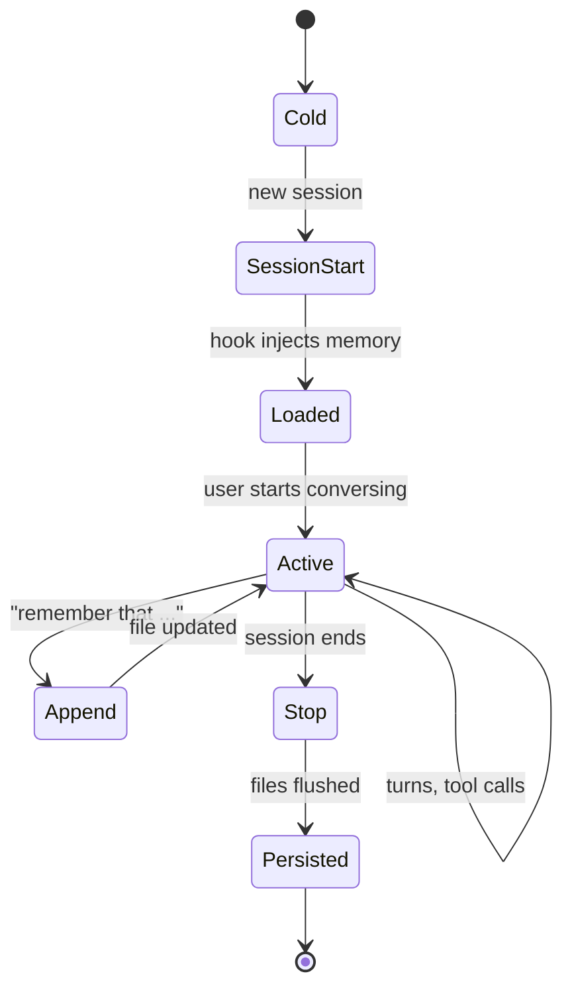

Writes are explicit. The model does not silently mutate memory mid-turn unless a skill or hook does it on its behalf.

---

# 9. Putting it all together

---

## A single session, end to end

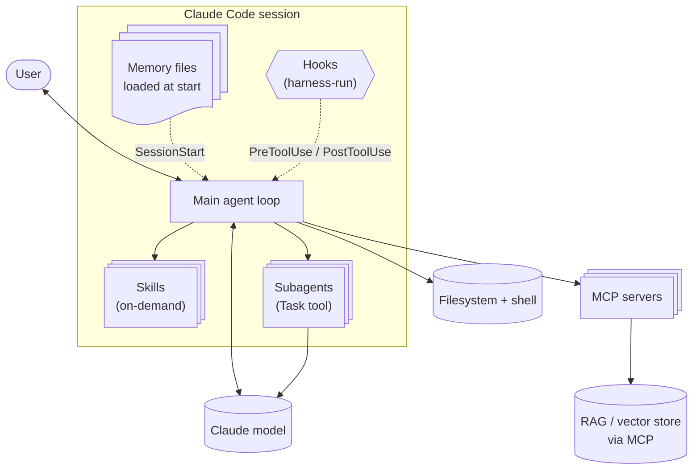

Each piece has one job. The orchestrator (main thread) is the only place they all meet.

---

## How the pieces actually compose

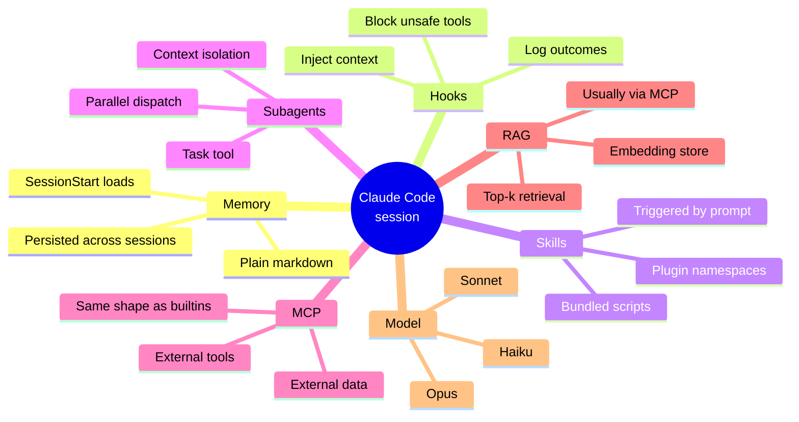

---

## Mental model in one timeline

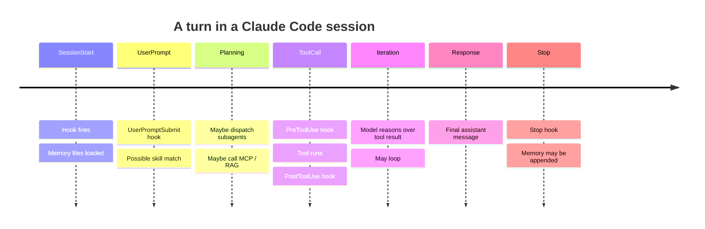

---

## Takeaways

- **One model, many surfaces.** CLI is canonical; everything else wraps it.
- **MCP is the extension boundary.** Anything external — repos, dashboards, vector stores — looks like a tool.
- **Subagents are for isolation, not cleverness.** Use them to keep contexts clean and parallelize.
- **Hooks are deterministic.** They run in the harness, not the model. Trust them for safety and logging.
- **Skills are lazy capabilities.** Metadata is always on; bodies load on match.
- **Memory is a file.** Read it, edit it, commit it.
- **RAG fills the long-tail.** When the corpus is bigger than the window, retrieve and inject.

Compose these and you get an agent that scales without becoming a black box.
