# Life in Diagrams

### Every Mermaid diagram type, applied to the human experience

---

## The Decision Tree of Being Born

*Flowchart — the branching logic that begins it all*

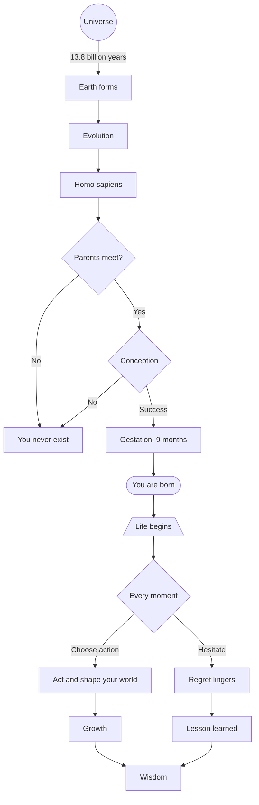

---

## First Words: A Sequence of Love

*Sequence diagram — the earliest exchange between parent and child*

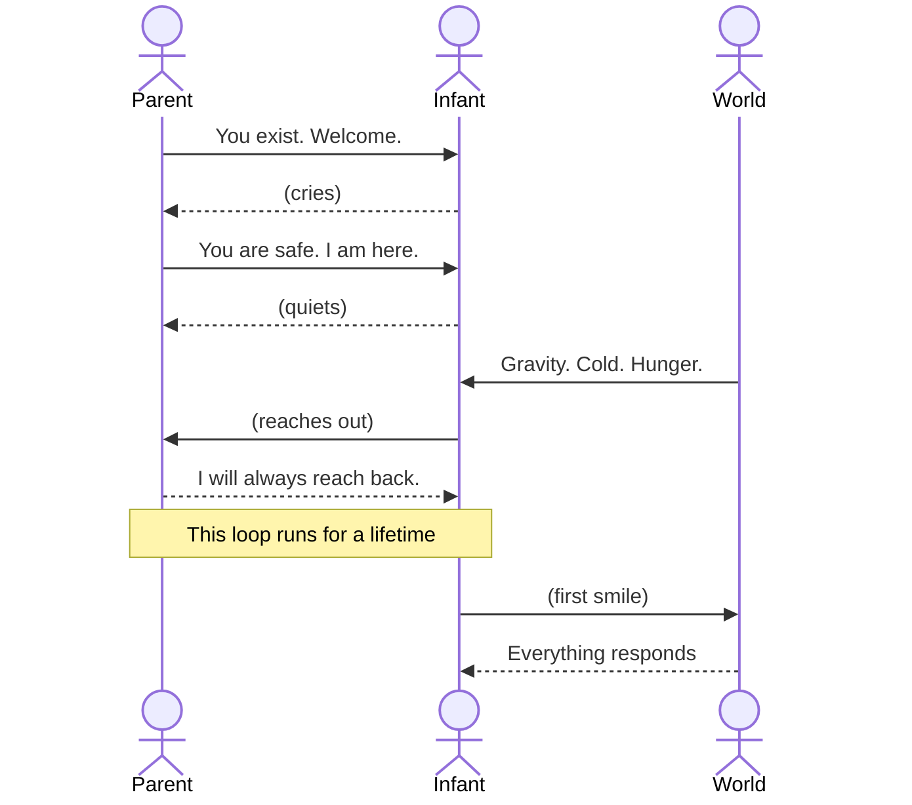

---

## The Taxonomy of a Person

*Class diagram — what we inherit, what we carry, what we pass on*

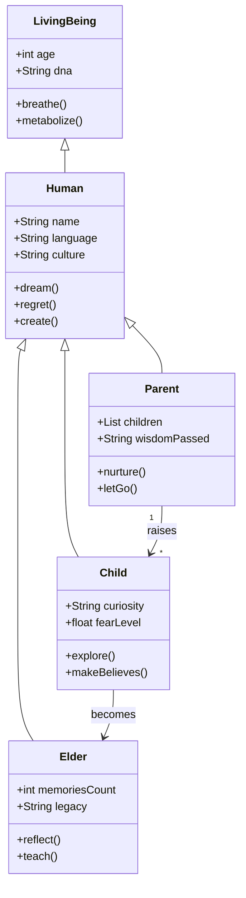

---

## States of the Human Mind

*State diagram — how consciousness cycles through its conditions*

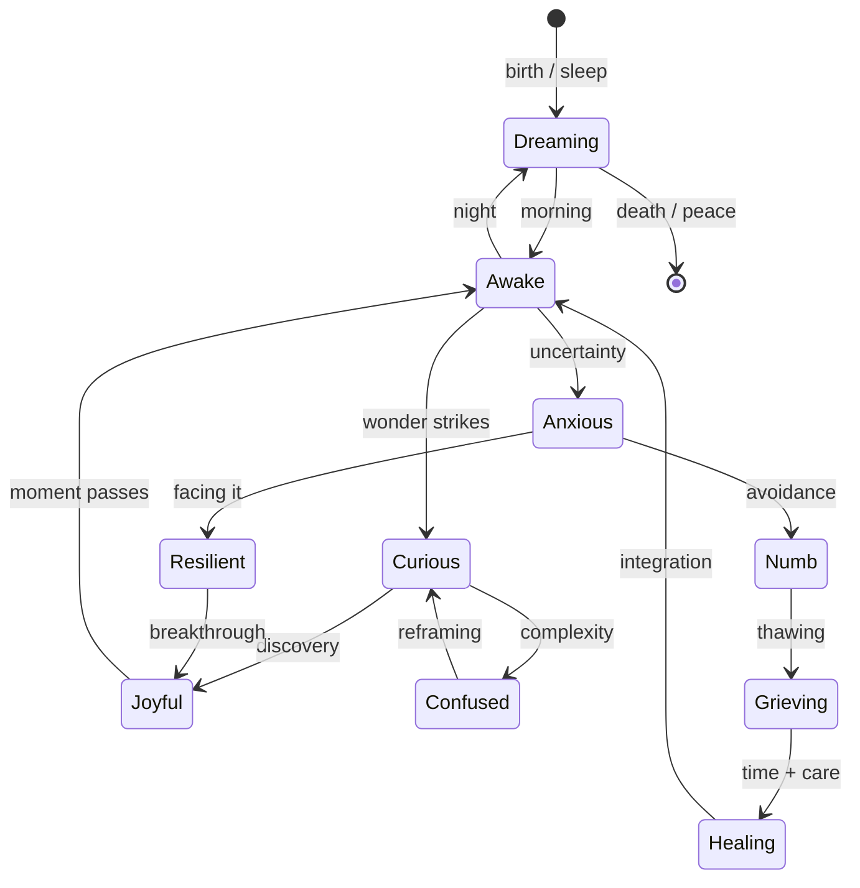

---

## The Relationships That Define Us

*ER diagram — the relational schema of a life*

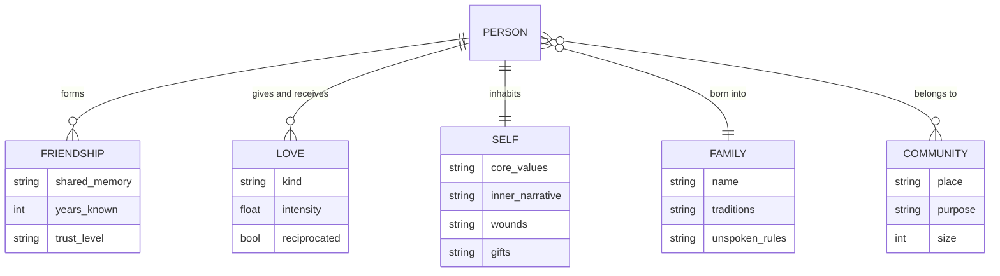

---

## A Human Life: Project Plan

*Gantt chart — the schedule we never agreed to but live anyway*

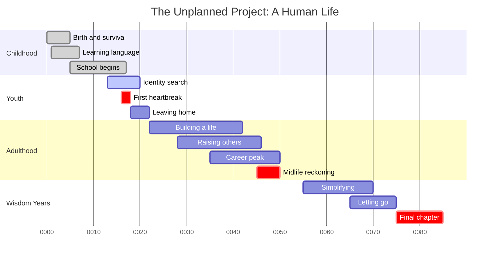

---

## How We Spend Our Days

*Pie chart — the honest accounting of a lifetime*

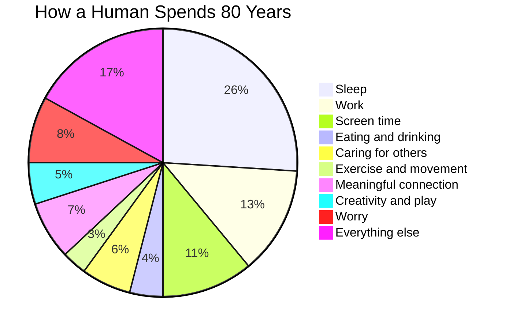

---

## The Map of a Mind

*Mindmap — the universe inside one skull*

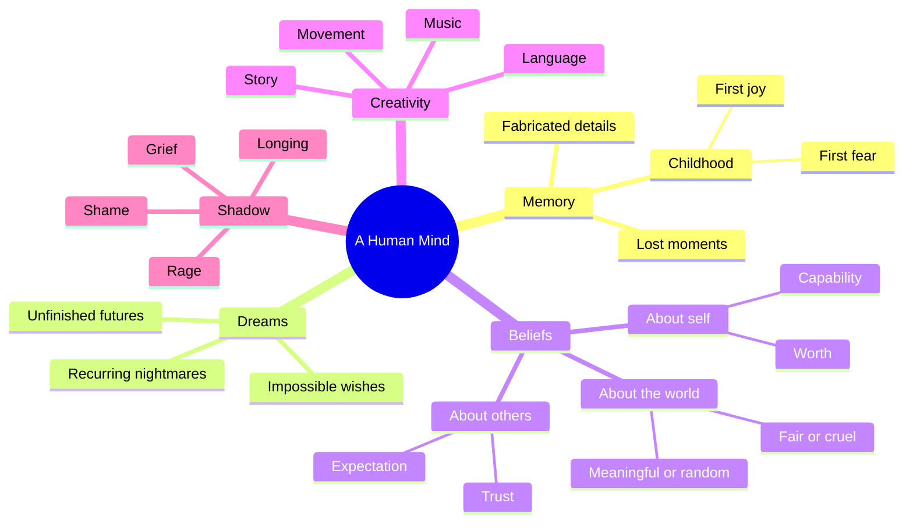

---

## Milestones of a Century

*Timeline — the arc from cradle to cosmos*

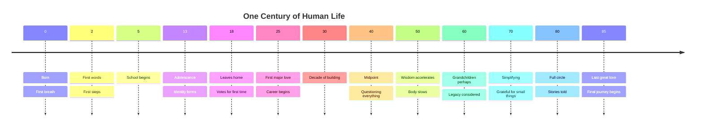

---

## The Evolution of Self: A Git History

*GitGraph — branching, merging, and who we become*

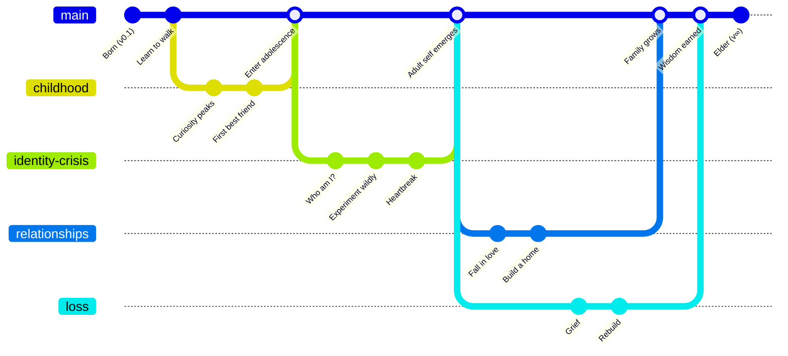

---

## The Journey of a Human Day

*User Journey — the emotional score of Tuesday*

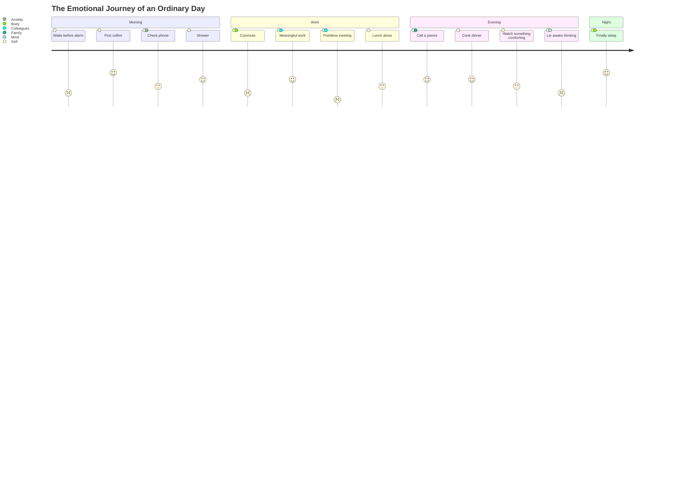

---

## Priorities vs. Time Spent

*Quadrant Chart — what matters vs. what gets our hours*

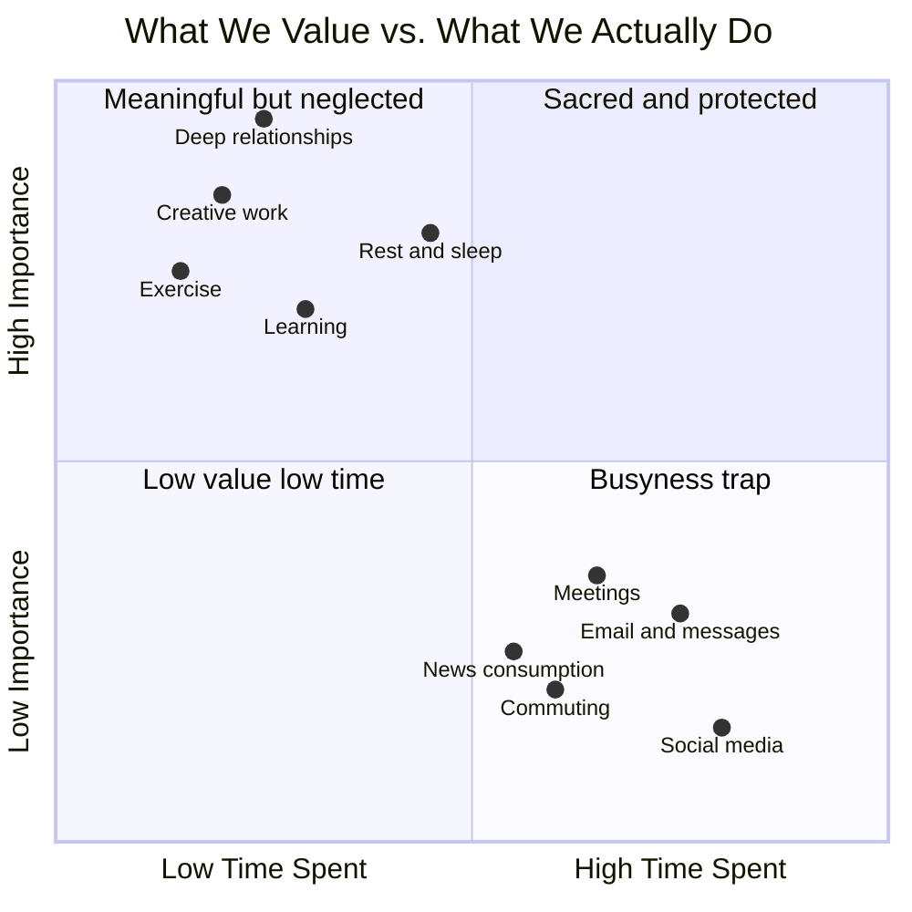

---

## The Requirements of a Good Life

*Requirement Diagram — what a meaningful life demands*

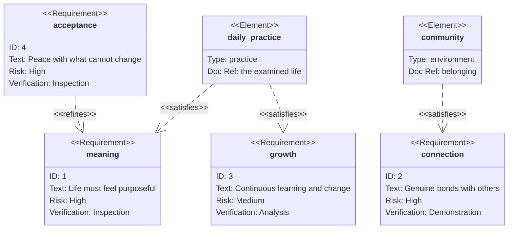

---

## Energy: How Life Flows Through the World

*Sankey diagram — the flow of vitality across living systems*

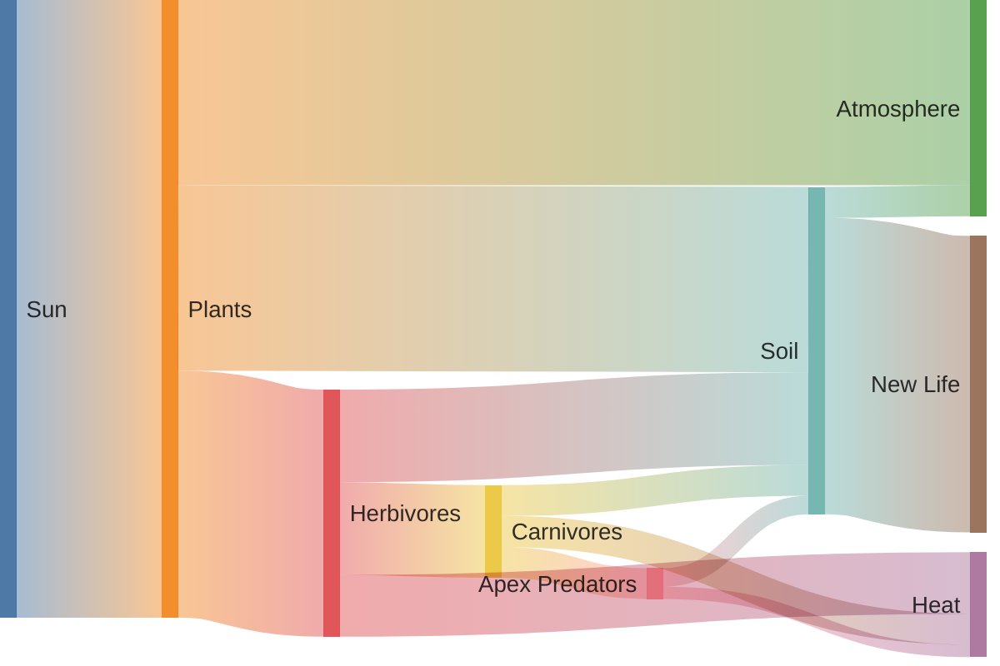

---

## Vitality Across the Lifespan

*XY Chart — the physical and emotional arc of a life*

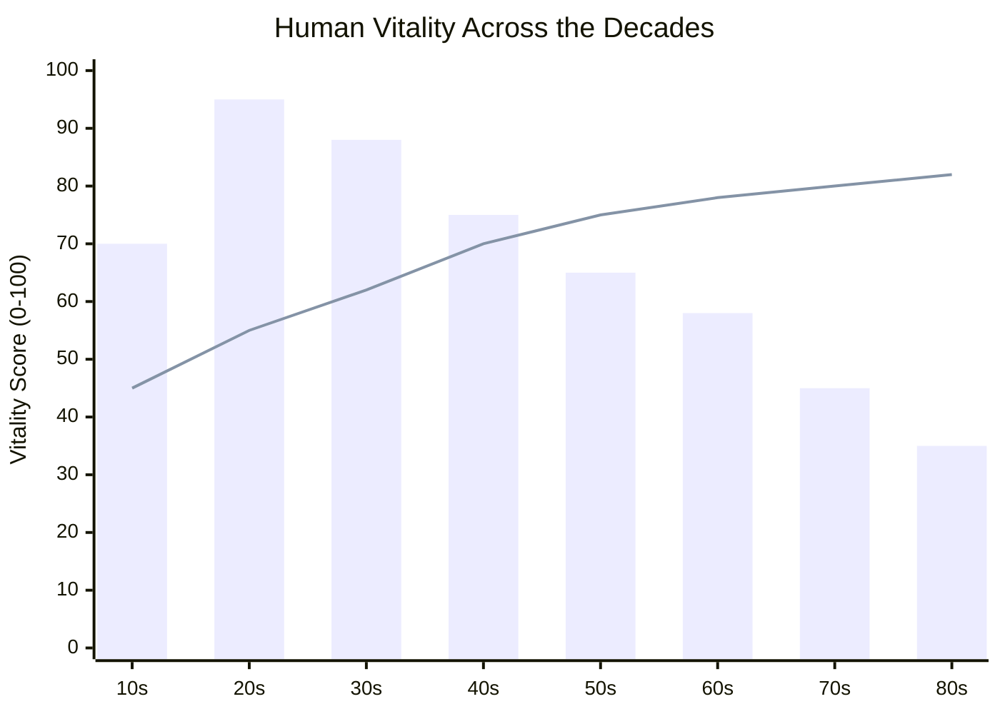

*Bars: physical energy. Line: wisdom and inner peace.*

---

## The Architecture of a Life

*Block diagram — the systems that hold us together*

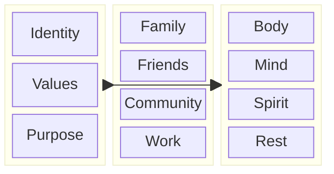

---

## The End Is Also a Beginning

*Flowchart — what happens to a life after it is lived*

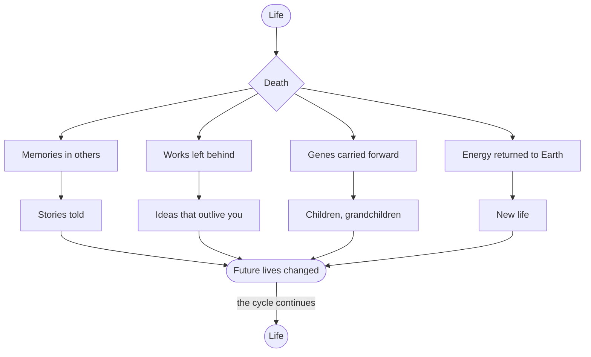

---

# Thank You

Life is not a problem to be solved.
It is a diagram to be drawn — imperfectly, beautifully, together.

*Every chart type tells a different truth about the same mystery.*
