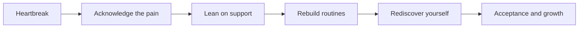

# Broken Hearts

> Understanding heartbreak — why it hurts, how it heals, and what comes after.

---

## What Is a Broken Heart?

- An intense emotional response to loss — a breakup, rejection, or death
- Not just a metaphor: the brain processes it like physical pain
- Activates the same regions tied to bodily injury
- A universal human experience across every culture and era

---

## The Science of Heartbreak

- Cortisol and adrenaline spike, triggering the stress response
- Dopamine and oxytocin crash after losing a bonded partner
- "Broken heart syndrome" (takotsubo cardiomyopathy) is a real cardiac event
- The brain craves the lost person much like an addiction withdrawal

---

## The Stages of Grief

- **Denial** — refusing to accept it's over
- **Anger** — resentment toward yourself or the other person
- **Bargaining** — "what if I had done things differently?"
- **Depression** — the heavy, hollow ache of loss
- **Acceptance** — making peace and moving forward

---

## How Healing Works

---

## Caring for Yourself

- Allow yourself to grieve — suppressing feelings prolongs them
- Reconnect with friends, family, and community
- Prioritize sleep, movement, and nourishment
- Limit contact and social-media checking on the lost person
- Seek a therapist if the weight becomes too heavy

---

## What Comes After

- Resilience grows — most people emerge stronger and clearer about their needs
- Heartbreak teaches what you truly value in connection
- Time genuinely does soften the sharpest edges
- The capacity to love again is never lost — only paused

---

## Heartbreak in Pop Music

- **Adele — "Someone Like You"**: the quiet ache of letting go set whole stadiums weeping
- **Fleetwood Mac — "Go Your Own Way"**: a band turning its own breakups into Rumours
- **Whitney Houston — "I Will Always Love You"**: love and farewell in the same breath
- **Taylor Swift — "All Too Well"**: the slow-burn epic that made heartbreak feel cinematic
- **Sinéad O'Connor — "Nothing Compares 2 U"**: one tear, one camera, total devastation

Pop turns private grief into shared catharsis — proof we never break alone.

---

## Closing

A broken heart is proof you dared to care. It mends.

Thanks.
