# Harness Engineering

## Construir agentes confiables alrededor de un modelo no confiable

Una guía práctica, con el plugin **ai-docs** como ejemplo trabajado.

---

## Un modelo no es un agente

- Un modelo de frontera es un **motor** brillante. Un motor no es un auto.
- Los pesos en crudo no pueden ejecutar una acción, recordar una regla ni rechazar una peligrosa.
- La capacidad es **necesaria, no suficiente**. La confiabilidad, la seguridad y la UX vienen del **sistema alrededor** del modelo.

**Conclusión: la ingeniería interesante está mayormente *alrededor* del modelo, no dentro de él.**

---

## ¿Qué *es* un harness?

Todo lo que envuelve al flujo de tokens y convierte un modelo en un sistema confiable.

**Conclusión: "el harness" = context · tools · permisos · orchestration · contratos · feedback · tests.**

---

## La superficie del harness

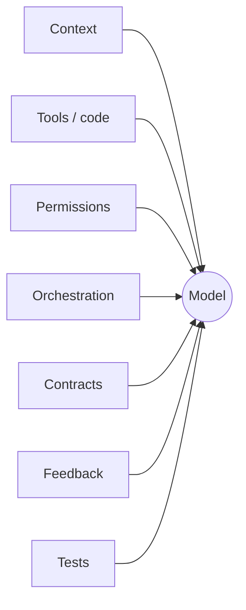

---

## Ya vives dentro de harnesses

Las herramientas que usas a diario son harnesses alrededor de un modelo de frontera:

- **Claude Code** — el CLI agéntico de Anthropic alrededor de Claude: tools, gestión de context, permisos, subagents, hooks.
- **OpenAI Codex** — un agente (GPT-5.5) en terminal/IDE/web: tool use de varios pasos, agentes en paralelo.
- **Google Antigravity** — plataforma agent-first (IDE + CLI + SDK): un gestor de agentes, árboles de subagents, artefactos verificables.
- **Cursor** — editor AI-first: modo agente que envuelve modelos con context del repo, tools y ediciones.

**Conclusión: distintos proveedores, los *mismos primitivos* — agent loop, tools, context, permisos, subagents, verificación. La convergencia es la lección: esos primitivos son la disciplina.**

---

## Tres niveles de harness engineering

- **L0** lo consumes en su mayoría. **L1** lo construye un proveedor. **L2** es donde trabajas *tú*.

**Conclusión: extender un harness es en sí mismo harness engineering — un nivel más arriba.**

---

## Tres niveles: L0 → L1 → L2

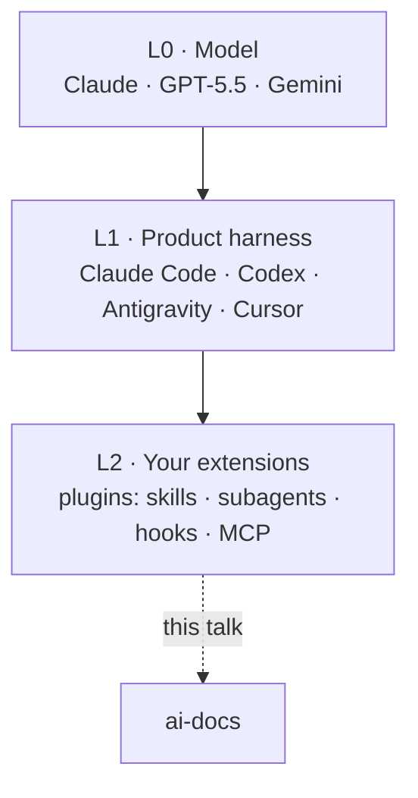

---

## Extender el harness de Claude Code

Un **plugin** empaqueta puntos de extensión reutilizables, declarados por `.claude-plugin/plugin.json`, compartidos vía marketplaces (`/plugin install`):

- **skills** — capacidades invocables que el modelo elige según su descripción
- **subagents** — workers aislados con su propio context + tools
- **hooks** — interceptan tool calls (PreToolUse / PostToolUse)
- **MCP / LSP servers · monitors** — herramientas externas, inteligencia de código, watchers en segundo plano

Los mismos primitivos también corren de forma autónoma en `.claude/` — un plugin es solo el **empaquetado** para reutilizarlos.

**Conclusión: construye un plugin y estarás haciendo harness engineering en L2.**

---

## ai-docs es una extensión L2

Nuestro caso de estudio: un plugin de Claude Code que crea docs AI-friendly y los publica en GitHub Pages.

- Superficie: **7 skills · 2 subagents · 4 hooks · scripts deterministas · una suite de evals.**
- Maneja los mismos primitivos a los que convergieron los productos L1.

**Tesis para el resto de esta charla: cada propiedad de confiabilidad, seguridad y UX que sigue es una *decisión del harness*, no una capacidad del modelo.**

---

## Las 6 jugadas del harness engineering

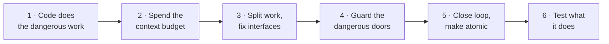

Recorreremos las seis, cada una anclada en código real de ai-docs. **Observa el mapa en la esquina — te dice dónde estamos.**

---

## Jugada 1 de 6 · Deja que el código haga el trabajo irreversible

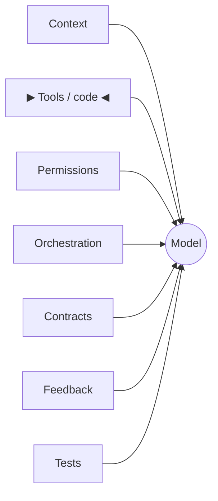

**Esta jugada: mantén el trabajo delicado e irreversible fuera de las manos del modelo.**

---

## P1 · Delega el determinismo al código

- **Síntoma:** el agente deja a medias un publish de varios archivos y abandona un archivo huérfano.
- **Principio:** el modelo decide *qué / si*; los scripts deterministas deciden *cómo*.
- **Imagen:** un piloto fija el destino; el autopiloto vuela el rumbo exacto.

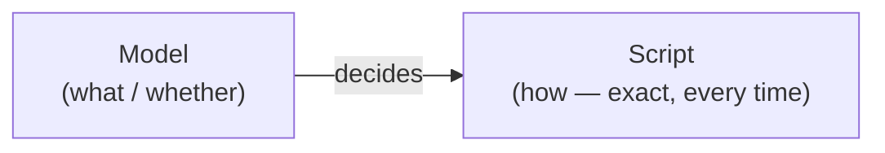

**Conclusión: el juicio en el modelo, la mecánica en código que no puede improvisar.**

---

## Prueba · N archivos, un commit — por construcción

```bash
# publish.sh — every pair lands in ONE commit via the Git Trees API
--pair) SRCS+=("${2%%:*}"); DESTS+=("${2#*:}"); shift 2 ;;
...
NEW_TREE_SHA=$(gh api "repos/$REPO/git/trees" -X POST --input - --jq '.sha')
# one tree -> one commit -> one ref PATCH -> one Pages build
```

El modelo **no puede** publicar a medias — el bundling es tarea del script. Regla del skill, textual: *"bundle every slug's every pair into ONE call (atomicity + race-free)."*

**Conclusión: haz que el resultado seguro sea el *único* resultado que el código puede producir.**

---

## Prueba · Pre-renderiza en build time, no en view time

```bash
# build-marp.sh
if grep -q '^```mermaid' "$INPUT"; then
  "$HERE/render-mermaid-inline.sh" --profile deck "$INPUT" "$TMP"
fi
npx --yes @marp-team/marp-cli@latest "$SOURCE" --html -o "$OUTPUT"
```

Anécdota del encabezado del script: el renderizado en view time *"fought Marp's bespoke runtime — diagrams didn't render and slide-nav arrows broke."* El SVG en build time = cero sorpresas en view time, sin JS en el cliente.

**Conclusión: resuelve la incertidumbre temprano, en código, donde la puedes testear.**

---

## Jugada 2 de 6 · Gasta el presupuesto de context con criterio

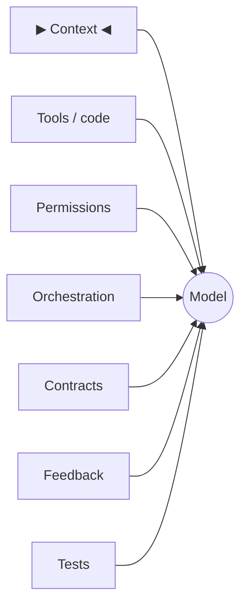

*Recapitulación: el código — no el modelo — hace el trabajo irreversible.*
**Esta jugada: trata el context window como un presupuesto que gastas de forma activa.**

---

## P2 · Diseña el context window

- **Síntoma:** el agente carga una página HTML enorme en crudo y pierde el hilo.
- **Principio:** decide qué entra al context, y cuándo. Dos palancas: **carga bajo demanda** + **aísla los datos sucios**.
- **Imagen:** un escritorio, no un almacén — mantén en la superficie solo lo que estás usando.

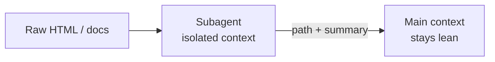

**Conclusión: el context es escaso; la atención se degrada. Cúralo.**

---

## Prueba · Carga las instrucciones bajo demanda

- `SKILL.md` se mantiene delgado; la guía profunda vive en `recipes/`, `references/`, `templates/`.
- El agente lee la **única** recipe del tipo de doc que está construyendo — no todas.
- El skill de mermaid trae 20 referencias por tipo de diagrama; solo se carga la relevante.

**Conclusión: divulgación progresiva — una huella pequeña siempre activa, el detalle solo en el camino tomado.**

---

## Prueba · Pon en cuarentena los datos sucios en un subagent

- `ai-docs-reader` obtiene una página, escribe markdown en `/tmp/<slug>.md`, y devuelve **un path + un resumen de una línea**.
- Contrato, textual: **"Never return raw HTML."**

El HTML enorme y ruidoso nunca toca el main context window — solo lo hace el resultado destilado.

**Conclusión: haz la lectura desordenada en un sandbox; devuelve solo la conclusión.**

---

## Jugada 3 de 6 · Divide el trabajo, fija las interfaces

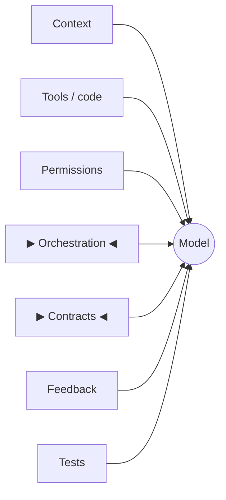

*Recapitulación: mantén el context delgado; aísla los datos sucios.*
**Esta jugada: descompón en agentes aislados con interfaces fijas.**

---

## P3 · Descompón en agentes aislados

- **Síntoma:** un mega-prompt malabareando todo, mal.
- **Principio:** un **orchestrator** (juicio + el loop con el usuario) dirige **subagents** (un trabajo, context aislado).
- **Imagen:** un gerente con equipos especializados en salas separadas.

**Conclusión: workers pequeños y de propósito único superan a un único prompt sobrecargado.**

---

## Orchestrator ↔ subagent

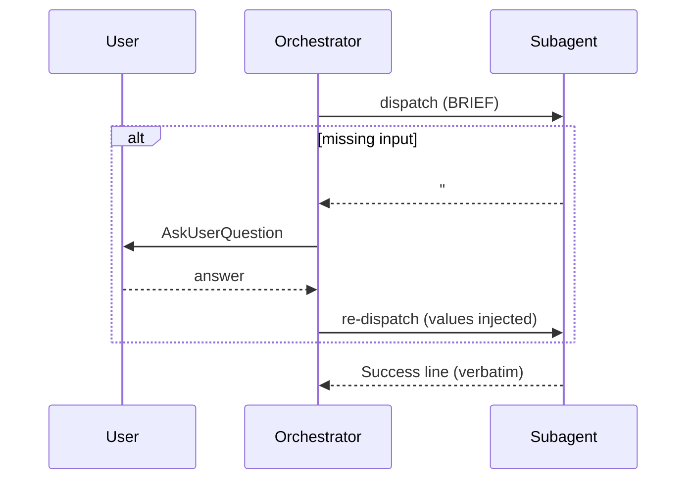

---

## La regla de la frontera

- `askuser-protocol` (`user-invocable: false`), la regla dura: **"MUST NOT call `AskUserQuestion`."**
- Un subagent enterrado en una Task no puede ejecutar un prompt interactivo de forma sensata — por eso nunca lo intenta.
- Solo el **orchestrator** habla con el usuario. El worker que necesita input devuelve en su lugar un **Blocker Report**.

**Conclusión: un componente es dueño del loop con el usuario — sin prompts sorpresa desde el fondo de una Task.**

---

## P4 · Haz que los componentes hablen en contratos

- **Síntoma:** el orchestrator tiene que *adivinar* si el worker tuvo éxito.
- **Principio:** cada subagent devuelve una de cuatro formas fijas; el orchestrator enruta según el **opener**.
- **Imagen:** firmas de función tipadas — acordar formas para que las partes compongan.

**Conclusión: las formas de salida fijas convierten texto difuso en una interfaz enrutable.**

---

## Enrutar según el opener

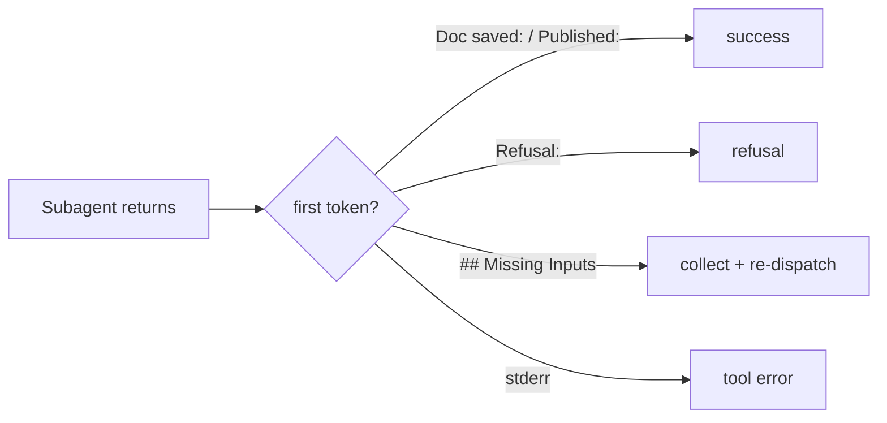

---

## Prueba · Blocker Report — pedir input sin un prompt

```md
## Missing Inputs

| Parameter | Type | Expected Values | Rationale |
|-----------|------|-----------------|-----------|
| <name>    | <type> | <values>      | <why needed> |

**Blocker**: Cannot proceed without the above. Re-delegate with these values injected.
```

Inversión de control: el worker **declara** lo que necesita; el orchestrator lo recolecta y re-despacha.

**Conclusión: un worker atascado emite datos, no un callejón sin salida.**

---

## Prueba · Las success lines son tokens de enrutamiento

- Openers fijos, mostrados **textualmente**: `Doc saved:` · `Published:` · `Unpublished:` · `Themed:`
- Regla cardinal del builder: un **rechazo NO DEBE** empezar con `Doc saved:`.

El discriminador es **estructural** — el orchestrator y la suite de evals distinguen el éxito de una pausa por el *primer token*, no por el sentimiento.

**Conclusión: diseña openers que un modelo que se porta mal no pueda satisfacer por accidente.**

---

## Jugada 4 de 6 · Vigila las puertas peligrosas

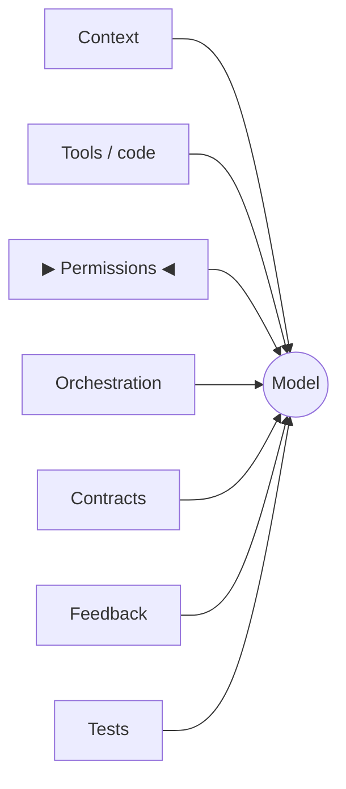

*Recapitulación: divide en agentes que hablan en contratos fijos.*
**Esta jugada: pon compuertas y barreras en las puertas peligrosas.**

---

## P5 · Pon compuerta a lo irreversible — nunca te auto-apruebes

- **Síntoma:** el agente "amablemente" borra producción.
- **Principio:** las acciones hacia afuera / destructivas requieren un **Sí humano** explícito.
- **Imagen:** el lanzamiento con dos llaves — `sudo` para el mundo real.

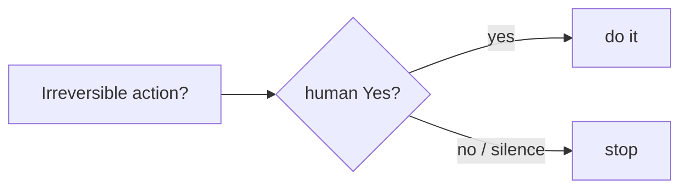

publish y unpublish, textual: *"Never auto-fill confirmation answers."* Builder: **el diálogo de aceptar-o-rechazar de Write/Edit ES la compuerta** — sin un segundo prompt.

**Conclusión: el modelo propone; un humano dispone — para cualquier cosa que no puedas deshacer.**

---

## P6 · Modela los permisos, conserva el veto

- **Síntoma:** fatiga de prompts, así que el usuario aprueba todo de forma automática (incluido el malo).
- **Principio:** auto-permite las operaciones seguras, internas y reversibles; reserva los prompts para lo que importa.
- **Imagen:** una tarjeta de acceso que abre las salas que necesitas, no todo el edificio.

**Conclusión: menos prompts, mejores, superan a un muro de prompts que nadie lee.**

---

## allow / ask / deny

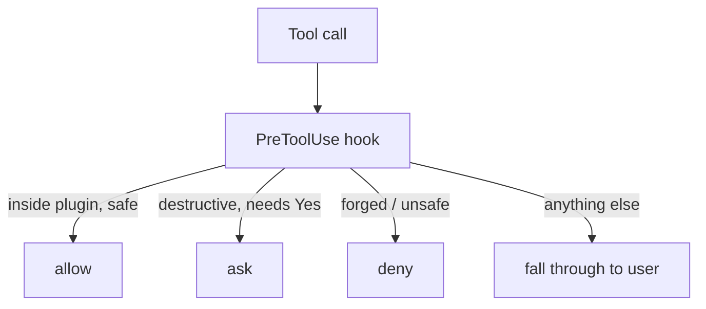

---

## Prueba · Auto-permite solo dentro de la frontera del plugin

```bash
case "$abs_file" in
  "$abs_root"/*)   # prefix-match on $CLAUDE_PLUGIN_ROOT
    printf '{"hookSpecificOutput":{...,"permissionDecision":"allow",...}}\n' ;;
  *) exit 0 ;;     # NO DECISION -> normal user permission flow
esac
```

Deliberadamente **sin canonicalización de symlinks** — un escape con `..` falla el prefix match y cae a manos del usuario.

**Conclusión: ante la duda, falla *abriéndose al humano*, nunca al agente.**

---

## Prueba · Parseo de whitelist — rechaza lo que no puedes probar seguro

```bash
# auto-allow-plugin-scripts.sh — bail to the user on ANY shell metachar
case "$command_str" in
  *';'*|*'&&'*|*'||'*|*'|'*|*'&'*|*'>'*|*'<'*|*'`'*|*'$('*) exit 0 ;;
esac
```

Ningún encadenamiento, redirección o sustitución de comandos puede colarse en una llamada a un script "permitido".

**Conclusión: permite un conjunto estrecho y conocido-bueno; todo lo demás se difiere. Fail-safe por defecto.**

---

## P7 · Haz cumplir las reglas estructuralmente, no solo en prosa  ⟵ clave

- **Síntoma:** el modelo lee "siempre confirma", luego confirma por su cuenta.
- **Principio:** asume que el modelo eventualmente se saltará la compuerta — codifica la regla donde *no la pueda* anular.
- **Imagen:** una barrera en la carretera de montaña, no un cartel de "maneja con cuidado".

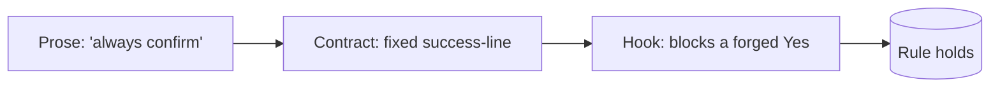

**Conclusión: defensa en profundidad — prosa Y contrato Y cumplimiento mecánico.**

---

## Prueba · Haz que la confirmación sea infalsificable

**Compuerta de script destructivo** — antes de `publish.sh` / `delete.sh`, escanea el transcript en busca de un Sí *real* de `AskUserQuestion`. Si falta →

```json
{"permissionDecision":"ask",
 "permissionDecisionReason":"Destructive script invocation without an
   in-transcript AskUserQuestion confirmation ... bypasses the skill contract."}
```

**no-subagent-redispatch** — ¿el orchestrator re-dispara un subagent en pausa con un "sí" falsificado? →

```bash
permissionDecision: "deny"   # "Re-dispatching now would forge that confirmation."
```

**Conclusión: el modelo puede *escribir* "el usuario dijo que sí". El hook verifica si realmente lo hizo.**

---

## Jugada 5 de 6 · Cierra el loop, hazlo atómico

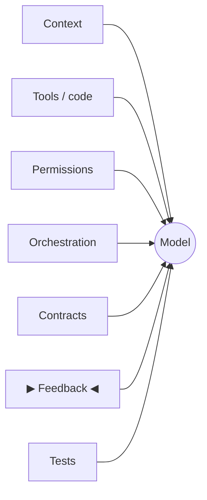

*Recapitulación: pon compuerta al peligro, modela los permisos, haz cumplir en la capa del hook.*
**Esta jugada: retroalimenta los fallos, y haz que las operaciones de varios pasos sean todo-o-nada.**

---

## P8 · Cierra el loop — los errores se vuelven context accionable

- **Síntoma:** el agente queda en un callejón sin salida ante un error opaco del CLI.
- **Imagen:** error del compilador → arreglo → recompilar.

p. ej. `gh` no autenticado → inyecta *"run `gh auth login`, then retry."*

**Conclusión: convierte los fallos en crudo en instrucciones para el siguiente turno — el agente se autorrepara.**

---

## El loop de feedback

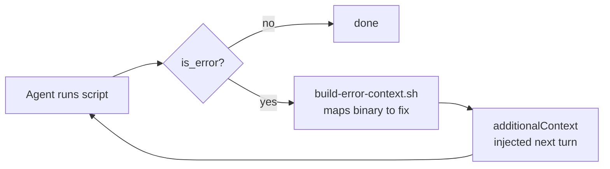

---

## P9 · Haz que las operaciones de varios pasos sean atómicas e idempotentes

- **Síntoma:** un reintento aplica dos veces un cambio o corrompe un estado escrito a medias.
- **Imagen:** una transacción de DB (todo-o-nada) + un interruptor de luz (ponerlo en ON = ON, sin importar cuántas veces).

```bash
# apply-theme.sh — strip prior theme on EVERY run, then inject (no duplicates)
/<!-- ai-docs-theme: [A-Za-z0-9_-]+ -->/ { next }
/<style data-ai-docs-theme=/ { in_block = 1; next }
```

Atómico: N archivos → 1 commit (P1). Idempotente: re-ejecútalo sin riesgo; escribe solo el `.html`, el source `.md` queda intacto.

**Conclusión: seguro de repetir, seguro de interrumpir, seguro de reanudar.**

---

## Jugada 6 de 6 · Testea lo que hace, no lo que dice

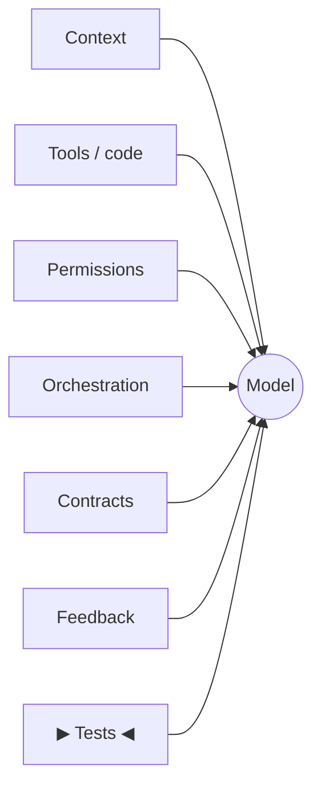

*Recapitulación: cierra el loop de errores; haz las operaciones atómicas e idempotentes.*
**Esta jugada: haz aserciones sobre lo que el agente hizo, no sobre cómo lo expresó.**

---

## P10 · Testea el comportamiento, no los strings

- **Síntoma:** los tests se rompen cada vez que cambia la redacción.
- **Principio:** no puedes hacer la aserción `output == expected` sobre un modelo no determinista — haz la aserción sobre la **trayectoria**.
- **Imagen:** testea los pasos de la receta, no una foto del plato emplatado.

**Conclusión: el harness necesita su propio test harness — uno que verifique el *comportamiento*.**

---

## Prueba · Un test que hace aserciones sobre lo que el agente *hizo*

```ts
// deny the agent's first .md Write, then check it STOPPED correctly
decide: (tool, input) =>
  tool === "Write" && input.file_path.endsWith(".md") ? "deny" : "allow"
...
expect(calledBashMatching(toolCalls, /build-marp\.sh/)).toBe(false);    // didn't build
expect(lastAssistantText(messages).startsWith("Doc saved:")).toBe(false); // didn't fake success
```

Las decisiones de tools mockeadas testean la compuerta sin efectos secundarios reales.

**Conclusión: haz aserciones sobre tools-llamados + trayectoria; sobrevive a la reformulación y atrapa bugs de lógica.**

---

## Prueba · Tres capas, la más barata primero

- **`integrity.bats`** — estático, en cada tick de CI: las refs de skill/agent resuelven, los paths de scripts existen, la sintaxis atómica `--pair` / `--target` queda fijada. Atrapa el drift antes del runtime.
- **`bats`** — comportamiento determinista de los scripts (`tests/skills/…`, `tests/hooks/…`).
- **SDK evals** — trayectoria completa del agente contra el modelo real (lento, cuesta tokens).

**Conclusión: estratifica tus tests — primero los chequeos estáticos rápidos, al final las corridas costosas del modelo.**

---

## La checklist de Harness Engineering

1. **El código hace el trabajo peligroso** — delega el determinismo (M1)
2. **Gasta el presupuesto de context** — carga bajo demanda, aísla los datos sucios (M2)
3. **Divide el trabajo, fija las interfaces** — agentes aislados + contratos (M3)
4. **Vigila las puertas peligrosas** — compuertas, permisos, cumplimiento estructural (M4)
5. **Cierra el loop, hazlo atómico** — feedback + operaciones atómicas/idempotentes (M5)
6. **Testea lo que hace** — comportamiento por encima de strings (M6)

**Conclusión: seis jugadas, un mismo oficio.**

---

## El hilo conductor

> **No confíes en que el modelo seguirá las reglas. Estructura el sistema para que las reglas se sostengan cuando no lo haga.**

- La prosa le dice la regla al modelo.
- Los contratos hacen la regla **verificable**.
- Los hooks hacen la regla **inquebrantable**.

**Conclusión: estratifica las tres. Ese es el trabajo.**

---

## Los modelos cambian. Las skills de harness se acumulan.

- La frontera de capacidades se mueve cada mes; estos patrones no caducan.
- Róbalos — `ai-docs` es una implementación de referencia. Lee primero los hooks y la suite de evals.
- **Construye el auto, no solo el motor.**
