# Harness Engineering

## Building reliable agents around an unreliable model

A field guide, with the **ai-docs** plugin as the worked example.

---

## A model is not an agent

- A frontier model is a brilliant **engine**. An engine is not a car.
- Raw weights can't take an action, remember a rule, or refuse a dangerous one.
- Capability is **necessary, not sufficient**. Reliability, safety, and UX come from the **system around** the model.

**Takeaway: the interesting engineering is mostly *around* the model, not inside it.**

---

## What *is* a harness?

Everything wrapped around the token stream that turns a model into a dependable system.

**Takeaway: "the harness" = context · tools · permissions · orchestration · contracts · feedback · tests.**

---

## The harness surface area

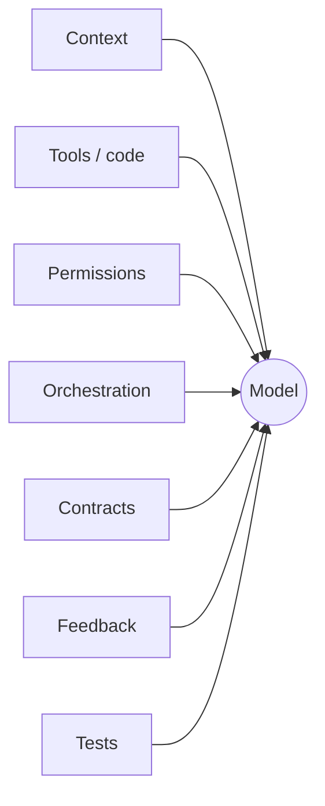

---

## You already live in harnesses

The tools you use every day are harnesses around a frontier model:

- **Claude Code** — Anthropic's agentic CLI around Claude: tools, context management, permissions, subagents, hooks.
- **OpenAI Codex** — one agent (GPT-5.5) across terminal/IDE/web: multi-step tool use, parallel agents.
- **Google Antigravity** — agent-first platform (IDE + CLI + SDK): an agent manager, subagent trees, verifiable artifacts.
- **Cursor** — AI-first editor: agent mode wrapping models with repo context, tools, and edits.

**Takeaway: different vendors, the *same primitives* — agent loop, tools, context, permissions, subagents, verification. The convergence is the lesson: those primitives are the discipline.**

---

## Three levels of harness engineering

- **L0** you mostly consume. **L1** a vendor builds. **L2** is where *you* work.

**Takeaway: extending a harness is itself harness engineering — one level up.**

---

## Three levels: L0 → L1 → L2

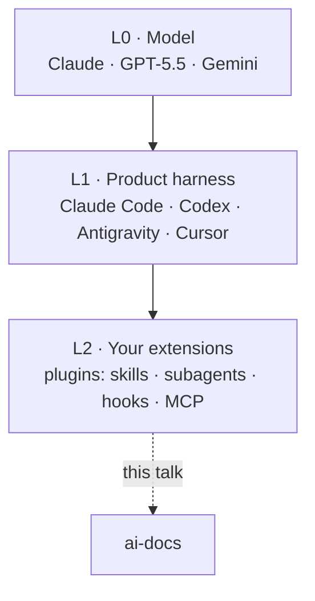

---

## Extending the Claude Code harness

A **plugin** bundles reusable extension points, declared by `.claude-plugin/plugin.json`, shared via marketplaces (`/plugin install`):

- **skills** — invocable capabilities the model picks up by description
- **subagents** — isolated workers with their own context + tools
- **hooks** — intercept tool calls (PreToolUse / PostToolUse)
- **MCP / LSP servers · monitors** — external tools, code intelligence, background watchers

The same primitives also run standalone in `.claude/` — a plugin is just the **packaging** for reuse.

**Takeaway: build a plugin and you are doing harness engineering at L2.**

---

## ai-docs is an L2 extension

Our case study: a Claude Code plugin that authors AI-friendly docs and publishes them to GitHub Pages.

- Surface: **7 skills · 2 subagents · 4 hooks · deterministic scripts · an eval suite.**
- It wields the very primitives the L1 products converged on.

**Thesis for the rest of this talk: every reliability, safety, and UX property below is a *harness decision*, not a model capability.**

---

## The 6 moves of harness engineering

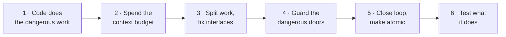

We'll walk all six, each grounded in real ai-docs code. **Watch the map in the corner — it tells you where we are.**

---

## Move 1 of 6 · Let code do the irreversible work

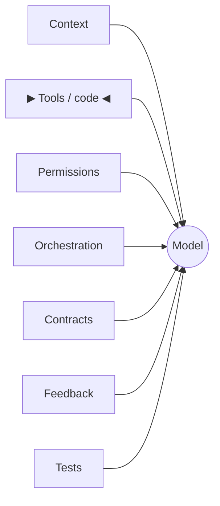

**This move: keep the fiddly, irreversible work out of the model's hands.**

---

## P1 · Offload determinism to code

- **Symptom:** the agent half-finishes a multi-file publish and leaves an orphaned file behind.
- **Principle:** the model decides *what / whether*; deterministic scripts decide *how*.
- **Picture:** a pilot sets the destination; the autopilot flies the exact bearing.

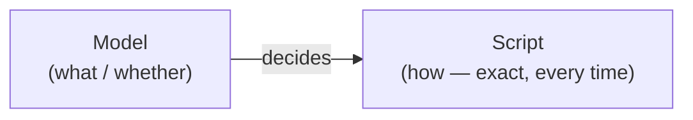

**Takeaway: judgment in the model, mechanics in code that can't improvise.**

---

## Proof · N files, one commit — by construction

```bash
# publish.sh — every pair lands in ONE commit via the Git Trees API
--pair) SRCS+=("${2%%:*}"); DESTS+=("${2#*:}"); shift 2 ;;
...
NEW_TREE_SHA=$(gh api "repos/$REPO/git/trees" -X POST --input - --jq '.sha')
# one tree -> one commit -> one ref PATCH -> one Pages build
```

The model **cannot** half-publish — bundling is the script's job. Skill rule, verbatim: *"bundle every slug's every pair into ONE call (atomicity + race-free)."*

**Takeaway: make the safe outcome the *only* outcome the code can produce.**

---

## Proof · Pre-render at build time, not view time

```bash
# build-marp.sh
if grep -q '^```mermaid' "$INPUT"; then
  "$HERE/render-mermaid-inline.sh" --profile deck "$INPUT" "$TMP"
fi
npx --yes @marp-team/marp-cli@latest "$SOURCE" --html -o "$OUTPUT"
```

War story from the script header: view-time rendering *"fought Marp's bespoke runtime — diagrams didn't render and slide-nav arrows broke."* Build-time SVG = zero view-time surprise, no client JS.

**Takeaway: resolve uncertainty early, in code, where you can test it.**

---

## Move 2 of 6 · Spend the context budget wisely

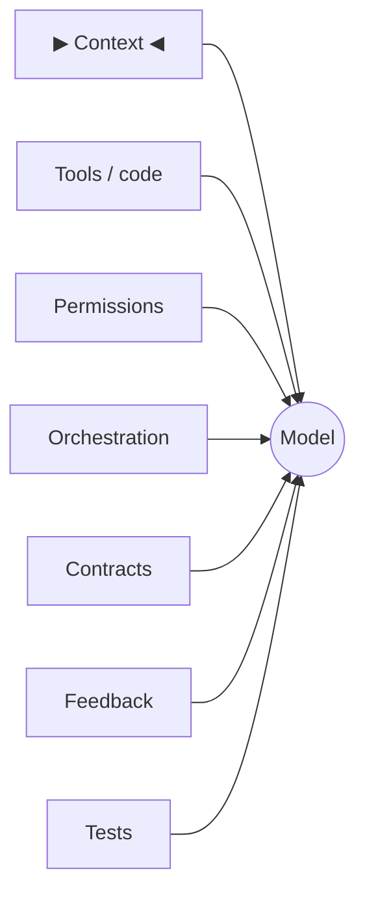

*Recap: code — not the model — does the irreversible work.*
**This move: treat the context window as a budget you actively spend.**

---

## P2 · Engineer the context window

- **Symptom:** the agent pulls in a giant raw HTML page and loses the thread.
- **Principle:** decide what enters context, and when. Two levers: **load on demand** + **isolate dirty data**.
- **Picture:** a desk, not a warehouse — keep only what you're using on the surface.

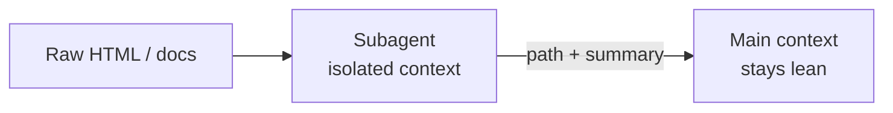

**Takeaway: context is scarce; attention degrades. Curate it.**

---

## Proof · Load instructions on demand

- `SKILL.md` stays thin; deep guidance lives in `recipes/`, `references/`, `templates/`.
- The agent reads the **one** recipe for the doc type it's building — not all of them.
- The mermaid skill ships 20 per-diagram references; only the relevant one is pulled in.

**Takeaway: progressive disclosure — small always-on footprint, detail only on the path taken.**

---

## Proof · Quarantine dirty data in a subagent

- `ai-docs-reader` fetches a page, writes markdown to `/tmp/<slug>.md`, returns **a path + one-line summary**.
- Contract, verbatim: **"Never return raw HTML."**

The huge, noisy HTML never touches the main context window — only the distilled result does.

**Takeaway: do the messy reading in a sandbox; hand back only the conclusion.**

---

## Move 3 of 6 · Split the work, fix the interfaces

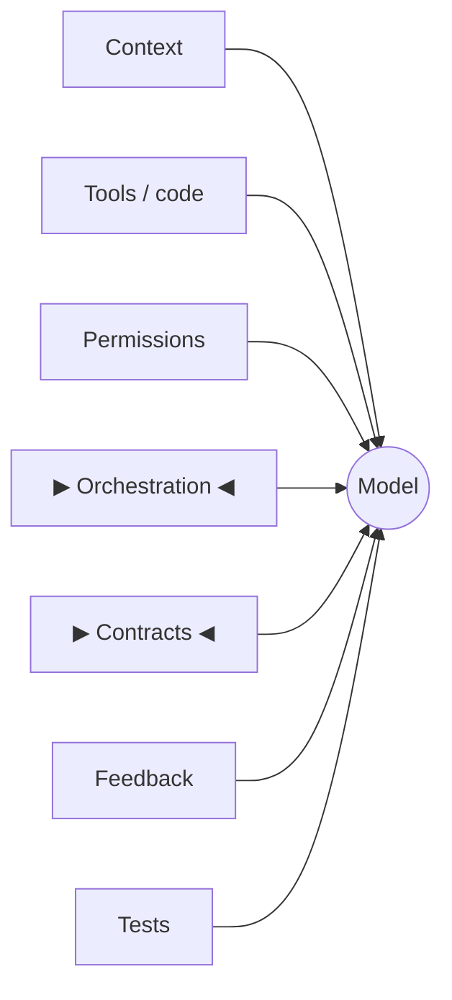

*Recap: keep context lean; isolate dirty data.*
**This move: decompose into isolated agents with fixed interfaces.**

---

## P3 · Decompose into isolated agents

- **Symptom:** one mega-prompt juggling everything, badly.
- **Principle:** an **orchestrator** (judgment + the user loop) directs **subagents** (one job, isolated context).
- **Picture:** a manager with specialist teams in separate rooms.

**Takeaway: small, single-purpose workers beat one overloaded prompt.**

---

## Orchestrator ↔ subagent

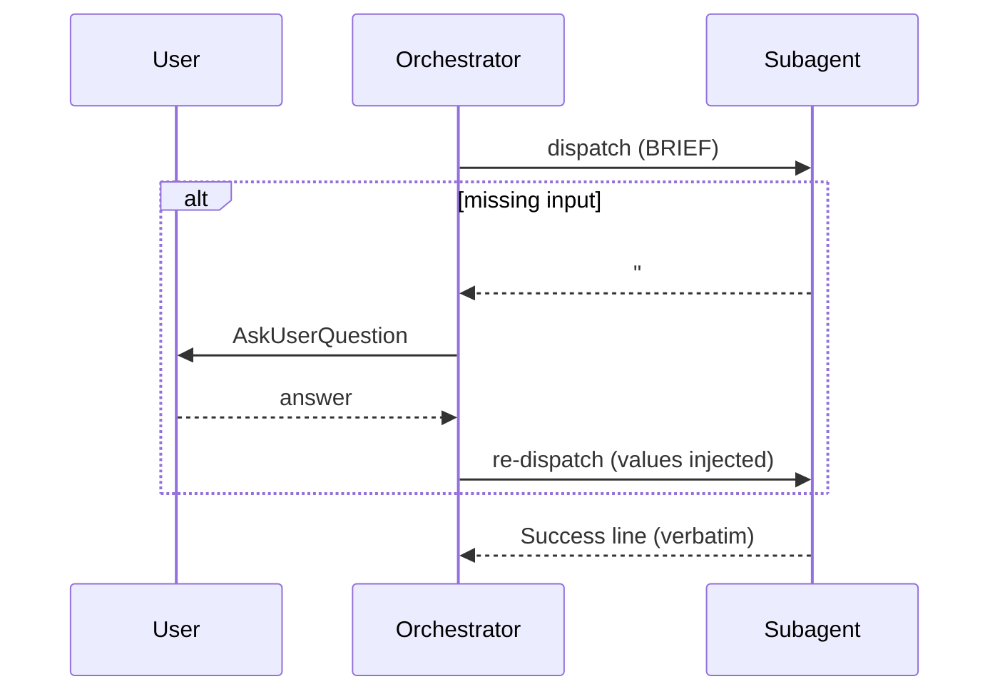

---

## The boundary rule

- `askuser-protocol` (`user-invocable: false`), the hard rule: **"MUST NOT call `AskUserQuestion`."**
- A subagent buried in a Task can't run an interactive prompt sanely — so it never tries.
- Only the **orchestrator** talks to the user. The worker that needs input returns a **Blocker Report** instead.

**Takeaway: one component owns the user loop — no surprise prompts from deep in a Task.**

---

## P4 · Make components speak in contracts

- **Symptom:** the orchestrator has to *guess* whether the worker succeeded.
- **Principle:** every subagent returns one of four fixed shapes; the orchestrator routes on the **opener**.
- **Picture:** typed function signatures — agree on shapes so parts compose.

**Takeaway: fixed output shapes turn fuzzy text into a routable interface.**

---

## Routing on the opener

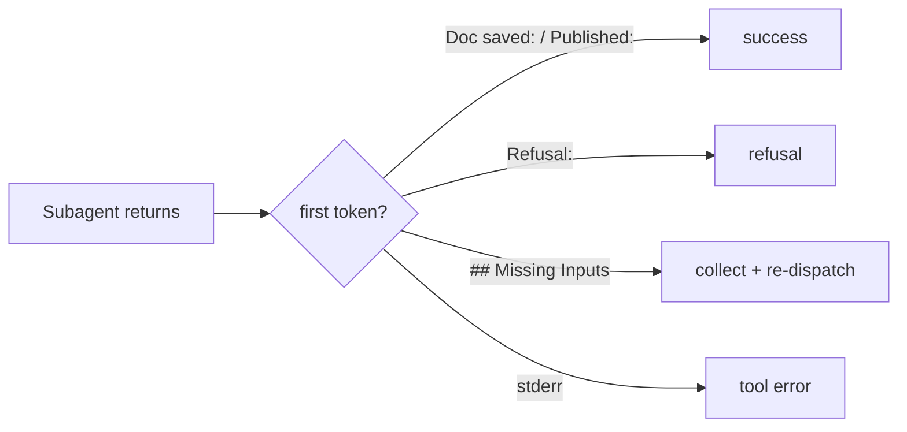

---

## Proof · Blocker Report — asking for input without a prompt

```md
## Missing Inputs

| Parameter | Type | Expected Values | Rationale |
|-----------|------|-----------------|-----------|
| <name>    | <type> | <values>      | <why needed> |

**Blocker**: Cannot proceed without the above. Re-delegate with these values injected.
```

Inversion of control: the worker **declares** what it needs; the orchestrator collects it and re-dispatches.

**Takeaway: a stuck worker emits data, not a dead end.**

---

## Proof · Success lines are routing tokens

- Fixed openers, surfaced **verbatim**: `Doc saved:` · `Published:` · `Unpublished:` · `Themed:`
- Builder cardinal rule: a **rejection MUST NOT** start with `Doc saved:`.

The discriminator is **structural** — orchestrator and eval suite tell success from a pause by the *first token*, not by sentiment.

**Takeaway: design openers a misbehaving model can't satisfy by accident.**

---

## Move 4 of 6 · Guard the dangerous doors

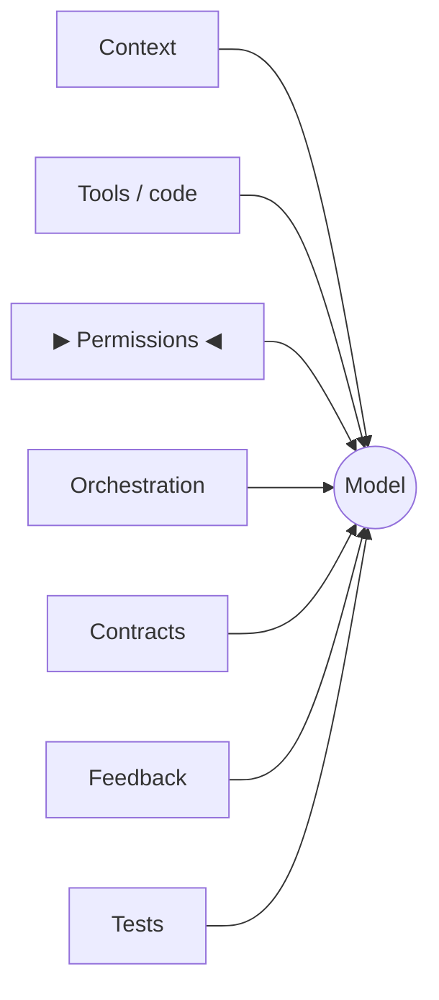

*Recap: split into agents that speak in fixed contracts.*
**This move: put gates and guardrails on the dangerous doors.**

---

## P5 · Gate the irreversible — never self-approve

- **Symptom:** the agent "helpfully" deletes prod.
- **Principle:** outward / destructive actions require an explicit **human Yes**.
- **Picture:** the two-key launch — `sudo` for the real world.

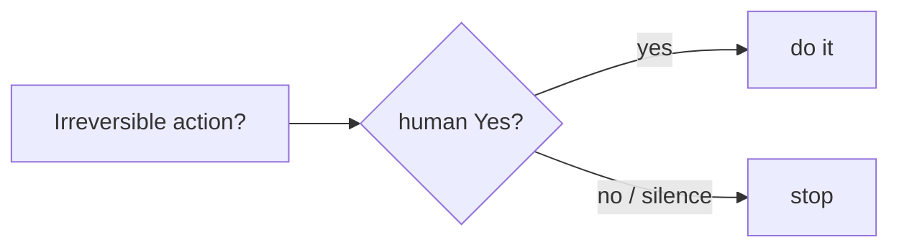

publish & unpublish, verbatim: *"Never auto-fill confirmation answers."* Builder: **the Write/Edit accept-or-reject dialog IS the gate** — no second prompt.

**Takeaway: the model proposes; a human disposes — for anything you can't undo.**

---

## P6 · Shape permissions, keep the veto

- **Symptom:** prompt-fatigue, so the user rubber-stamps everything (including the bad one).
- **Principle:** auto-allow the safe, internal, reversible ops; reserve prompts for what matters.
- **Picture:** a keycard that opens the rooms you need, not the whole building.

**Takeaway: fewer, better prompts beat a wall of prompts nobody reads.**

---

## allow / ask / deny

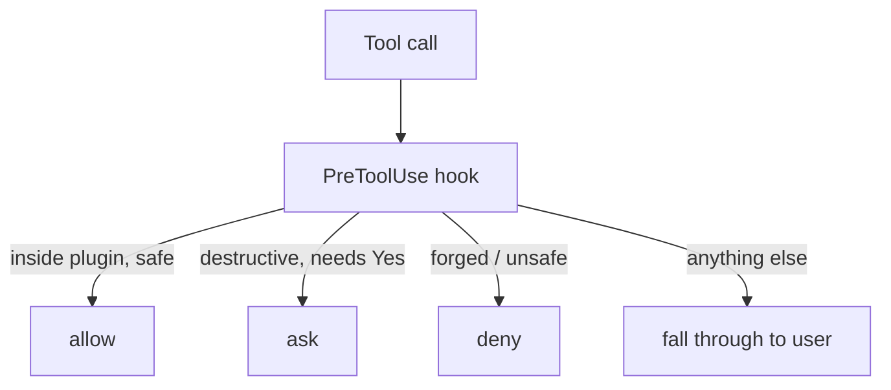

---

## Proof · Auto-allow only inside the plugin boundary

```bash
case "$abs_file" in
  "$abs_root"/*)   # prefix-match on $CLAUDE_PLUGIN_ROOT
    printf '{"hookSpecificOutput":{...,"permissionDecision":"allow",...}}\n' ;;
  *) exit 0 ;;     # NO DECISION -> normal user permission flow
esac
```

Deliberately **no symlink canonicalization** — a `..` escape fails the prefix match and falls through to the user.

**Takeaway: when unsure, fail *open to the human*, never to the agent.**

---

## Proof · Whitelist parsing — reject what you can't prove safe

```bash
# auto-allow-plugin-scripts.sh — bail to the user on ANY shell metachar
case "$command_str" in
  *';'*|*'&&'*|*'||'*|*'|'*|*'&'*|*'>'*|*'<'*|*'`'*|*'$('*) exit 0 ;;
esac
```

No chaining, redirect, or command-substitution can ride along on an "allowed" script call.

**Takeaway: allow a narrow known-good set; everything else defers. Fail-safe by default.**

---

## P7 · Enforce rules structurally, not just in prose  ⟵ keystone

- **Symptom:** the model reads "always confirm," then confirms on its own.
- **Principle:** assume the model will eventually skip the gate — encode the rule where it *can't* override it.
- **Picture:** a guardrail on the mountain road, not a "drive safe" sign.

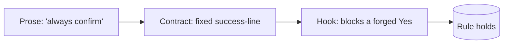

**Takeaway: defense in depth — prose AND contract AND mechanical enforcement.**

---

## Proof · Make the confirmation unforgeable

**Destructive-script gate** — before `publish.sh` / `delete.sh`, scan the transcript for a *real* `AskUserQuestion` Yes. Missing →

```json
{"permissionDecision":"ask",
 "permissionDecisionReason":"Destructive script invocation without an
   in-transcript AskUserQuestion confirmation ... bypasses the skill contract."}
```

**no-subagent-redispatch** — orchestrator re-fires a paused subagent with a forged "yes"? →

```bash
permissionDecision: "deny"   # "Re-dispatching now would forge that confirmation."
```

**Takeaway: the model can *write* "the user said yes." The hook checks whether they actually did.**

---

## Move 5 of 6 · Close the loop, make it atomic

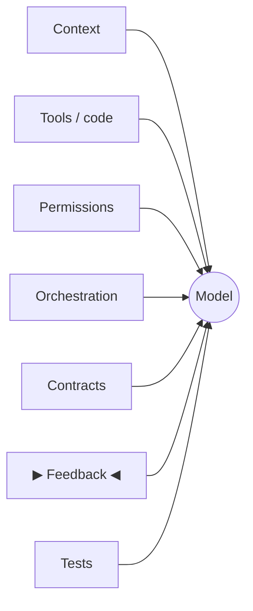

*Recap: gate danger, shape permissions, enforce at the hook layer.*
**This move: feed failures back, and make multi-step ops all-or-nothing.**

---

## P8 · Close the loop — errors become actionable context

- **Symptom:** the agent dead-ends on an opaque CLI error.
- **Picture:** compiler error → fix → recompile.

e.g. `gh` not authenticated → injects *"run `gh auth login`, then retry."*

**Takeaway: turn raw failures into the next turn's instructions — the agent self-heals.**

---

## The feedback loop

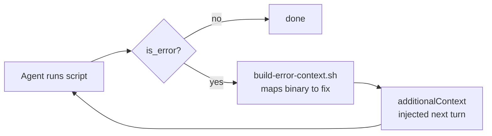

---

## P9 · Make multi-step ops atomic & idempotent

- **Symptom:** a retry double-applies a change or corrupts half-written state.
- **Picture:** a DB transaction (all-or-nothing) + a light switch (flip to ON = ON, however many times).

```bash
# apply-theme.sh — strip prior theme on EVERY run, then inject (no duplicates)
/<!-- ai-docs-theme: [A-Za-z0-9_-]+ -->/ { next }
/<style data-ai-docs-theme=/ { in_block = 1; next }
```

Atomic: N files → 1 commit (P1). Idempotent: re-run safely; writes `.html` only, source `.md` stays pristine.

**Takeaway: safe to repeat, safe to interrupt, safe to resume.**

---

## Move 6 of 6 · Test what it does, not what it says

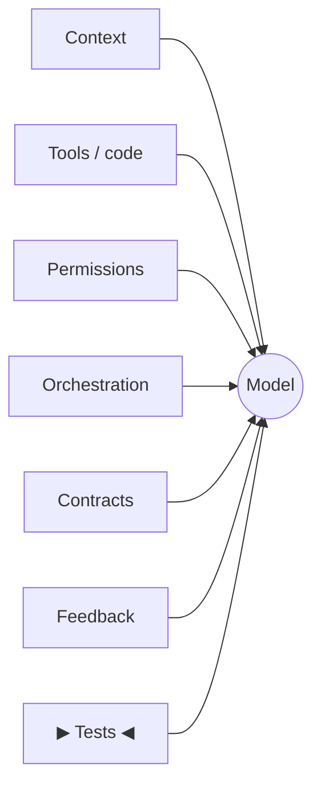

*Recap: close the error loop; make ops atomic + idempotent.*
**This move: assert on what the agent did, not how it phrased it.**

---

## P10 · Test behavior, not strings

- **Symptom:** tests break every time the wording changes.
- **Principle:** you can't assert `output == expected` on a non-deterministic model — assert on the **trajectory**.
- **Picture:** test the recipe steps, not a photo of the plated dish.

**Takeaway: the harness needs its own test harness — one that checks *behavior*.**

---

## Proof · A test that asserts on what the agent *did*

```ts
// deny the agent's first .md Write, then check it STOPPED correctly
decide: (tool, input) =>
  tool === "Write" && input.file_path.endsWith(".md") ? "deny" : "allow"
...
expect(calledBashMatching(toolCalls, /build-marp\.sh/)).toBe(false);    // didn't build
expect(lastAssistantText(messages).startsWith("Doc saved:")).toBe(false); // didn't fake success
```

Mocked tool decisions test the gate without real side effects.

**Takeaway: assert tools-called + trajectory; it survives rephrasing and catches logic bugs.**

---

## Proof · Three layers, cheapest first

- **`integrity.bats`** — static, every CI tick: skill/agent refs resolve, script paths exist, atomic `--pair` / `--target` syntax pinned. Catches drift before runtime.
- **`bats`** — deterministic script behavior (`tests/skills/…`, `tests/hooks/…`).
- **SDK evals** — full agent trajectory against the real model (slow, costs tokens).

**Takeaway: layer your tests — fast static checks first, expensive model runs last.**

---

## The Harness Engineering checklist

1. **Code does the dangerous work** — offload determinism (M1)
2. **Spend the context budget** — load on demand, isolate dirty data (M2)
3. **Split work, fix interfaces** — isolated agents + contracts (M3)
4. **Guard the dangerous doors** — gates, permissions, structural enforcement (M4)
5. **Close the loop, make it atomic** — feedback + atomic/idempotent ops (M5)
6. **Test what it does** — behavior over strings (M6)

**Takeaway: six moves, one craft.**

---

## The throughline

> **Don't trust the model to follow the rules. Structure the system so the rules hold when it doesn't.**

- Prose tells the model the rule.
- Contracts make the rule **checkable**.
- Hooks make the rule **unbreakable**.

**Takeaway: layer all three. That's the job.**

---

## Models change. Harness skills compound.

- The capability frontier moves monthly; these patterns don't expire.
- Steal them — `ai-docs` is a reference implementation. Read the hooks and the eval suite first.
- **Build the car, not just the engine.**
