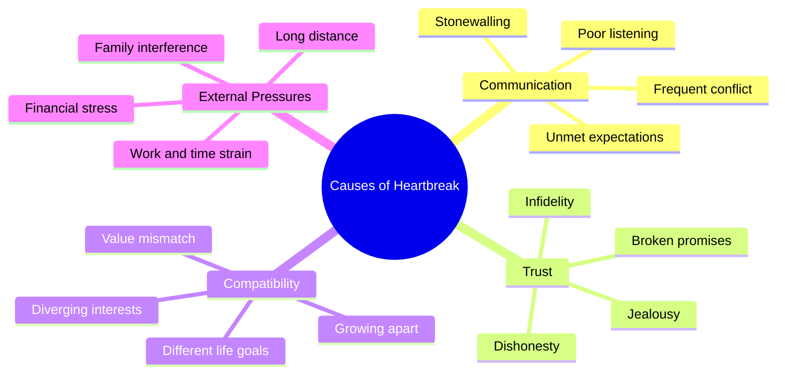

# Broken Hearts: Statistics and Causes

Heartbreak is one of the most common emotional experiences across cultures and age groups, yet its prevalence and consequences are often underestimated. This page summarizes key statistics on breakups, divorce, and the emotional and physical toll of a broken heart, alongside a mindmap of the leading causes. The data draws on relationship surveys, public-health research, and studies on stress cardiomyopathy ("broken heart syndrome").

## By the Numbers

| Statistic | Figure | Context |
|-----------|--------|---------|
| Adults who report at least one major heartbreak in their lifetime | ~85% | Most people experience significant romantic loss at least once |
| Average number of breakups before a long-term partnership | 2–3 | Varies by region and age cohort |
| Typical emotional recovery time after a serious breakup | 3–6 months | Median; some recover faster, others much slower |
| Marriages ending in divorce (many Western countries) | ~40% | Long-run lifetime probability |
| Breakups initiated in the first year of a relationship | ~50% | The first year is the highest-risk period |
| Cases of stress cardiomyopathy ("broken heart syndrome") that follow emotional distress | ~70% | Often triggered by grief, breakup, or sudden loss |
| Stress cardiomyopathy patients who are women | ~90% | Overwhelmingly affects post-menopausal women |

## Emotional Impact

- Heartbreak activates the same brain regions associated with physical pain.
- Loss of a partner is consistently ranked among the most stressful life events, alongside bereavement and job loss.
- Sleep disruption, appetite changes, and reduced concentration are reported by a majority of people in the first weeks after a breakup.
- Social support is the single strongest predictor of faster recovery.

## Physical Impact: Broken Heart Syndrome

"Broken heart syndrome," clinically known as **takotsubo cardiomyopathy**, is a temporary heart condition often brought on by stressful situations and extreme emotions. Symptoms can mimic a heart attack, including chest pain and shortness of breath, but the condition is usually reversible.

- Most commonly triggered by acute emotional or physical stress.
- The heart's main pumping chamber temporarily changes shape and enlarges.
- The majority of patients recover within days to weeks.

## Mindmap of Causes

The following mindmap organizes the most frequently cited causes of relationship breakdown and heartbreak into four major branches.

## Key Takeaways

1. Heartbreak is nearly universal and has measurable emotional and physical effects.
2. The first year of a relationship and the long-run probability of divorce represent the two highest-risk windows.
3. Communication breakdown and broken trust are the most commonly cited causes.
4. Recovery is strongly aided by social support, time, and self-care.

## Sources

- Relationship and divorce trend surveys (national statistics agencies).
- Public-health literature on grief and stress-related illness.
- Clinical research on takotsubo (stress) cardiomyopathy.
