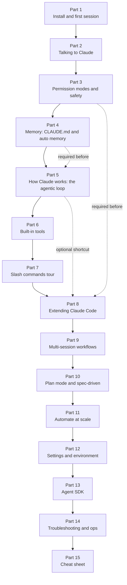
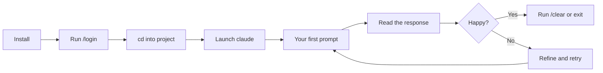
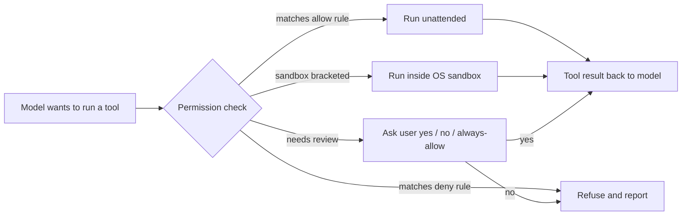
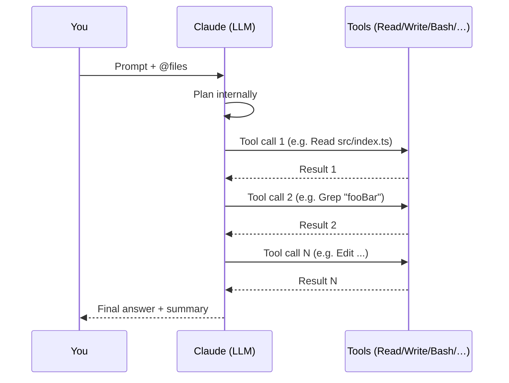
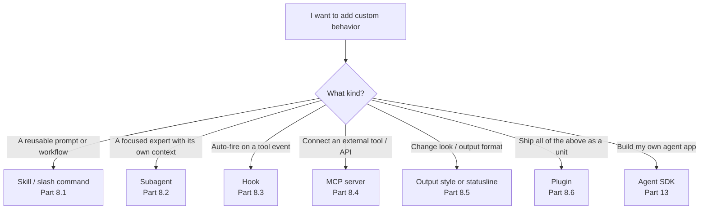
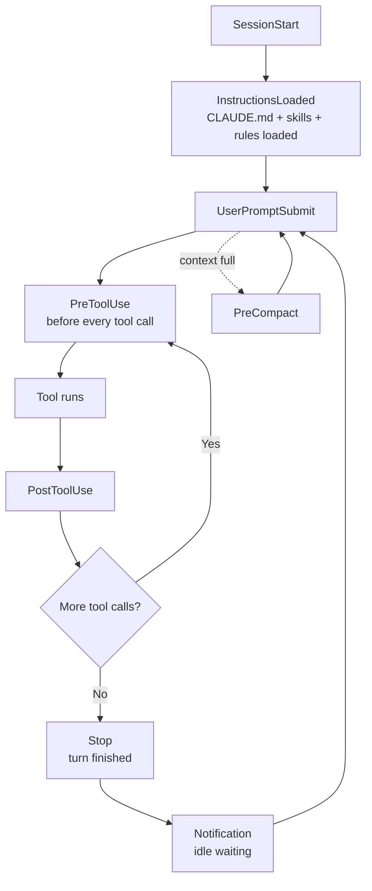
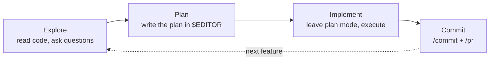
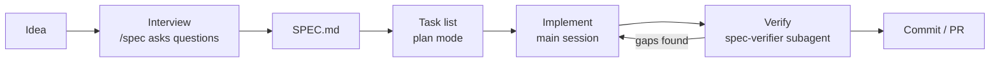
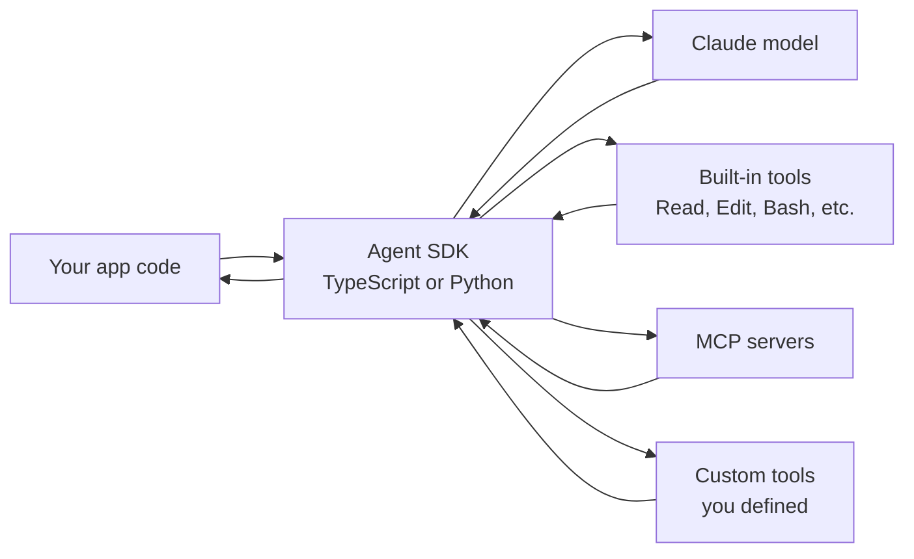
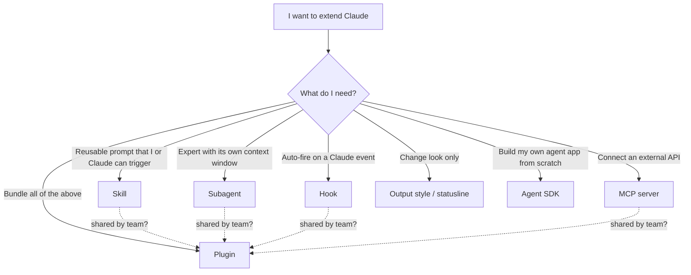

# Claude Code: From Zero to Advanced

**Subtitle.** Step-by-step guide, beginner to expert, verified against the official docs.

**Last verified.** 2026-05-12.

This guide is built from the official docs at https://code.claude.com/docs/en/overview.md. Whenever something here disagrees with the official page, trust the official page — claude code evolves fast.

## Roadmap



Read in order if you're new. Skim if you're a returning user — Parts 8, 10, 11, 15 are the deep technical chapters.

Source: https://code.claude.com/docs/en/overview.md

---

## Part 1 — Install and first session

### Install

macOS / Linux / WSL (native):

```bash
curl -fsSL https://claude.ai/install.sh | bash
```

Windows PowerShell (native):

```powershell
irm https://claude.ai/install.ps1 | iex
```

Windows CMD (native):

```cmd
curl -fsSL https://claude.ai/install.cmd -o install.cmd && install.cmd && del install.cmd
```

Homebrew (stable):

```bash
brew install --cask claude-code
```

Homebrew (latest):

```bash
brew install --cask claude-code@latest
```

WinGet:

```powershell
winget install Anthropic.ClaudeCode
```

For apt / dnf / apk packages on Linux, see the setup page: https://code.claude.com/docs/en/setup.md.

### Alternatives to the CLI

- **IDE plugins.** VS Code, JetBrains, Zed have native integrations. See https://code.claude.com/docs/en/ide-integrations.md.
- **Desktop.** Standalone Mac/Windows app. See https://code.claude.com/docs/en/claude-code-desktop.md.
- **Web.** Run Claude Code in a browser. See https://code.claude.com/docs/en/claude-code-on-the-web.md.

### Start a session

```bash
claude
```

First run will prompt `/login`. Account types accepted:

- Anthropic Pro, Max, Team, Enterprise plans
- Anthropic Console (pre-paid API credit)
- Amazon Bedrock, Google Cloud Vertex AI, Azure / Microsoft Foundry

See https://code.claude.com/docs/en/quickstart.md.

### First-session essentials

| Command | Purpose |
|---|---|
| `claude` | Start an interactive session in the current directory |
| `claude "task"` | Start a session with an initial prompt |
| `claude -p "query"` | Run one-shot non-interactive (headless) and print the answer |
| `claude -c` | Continue the most recent session in this directory |
| `claude -r` | Resume a prior session by picker |
| `/help` | List built-in slash commands inside a session |
| `/clear` | Wipe session context and start fresh |
| `exit` / Ctrl+D | Quit the session |

### Five first prompts to try

```text
Summarize the structure of this repo.
What does the file in src/index.ts do?
Run the tests and fix any failing ones.
Add a README section explaining how to run locally.
Why is the build slow? Investigate and propose a fix.
```

### Visual: first-session flow



Source: https://code.claude.com/docs/en/quickstart.md

---

## Part 2 — Talking to Claude

### The slash menu

Press `/` at the prompt to open the menu. `Tab` completes the currently-highlighted entry. Up arrow walks command history.

### Referencing files and directories

```text
Review @src/auth.ts and explain the JWT flow.
Compare @src/old/ with @src/new/ — what changed?
Use the schema in @server:postgres:schema/public to draft a migration.
```

- `@<path>` inlines a file or directory listing.
- Multiple `@` references in one message are fine.
- `@server:resource` references a Model Context Protocol (MCP) resource from a connected server — covered in Part 8.4.

### Images and dictation

- **Paste in CLI**: `Ctrl+V` (NOT `Cmd+V` on macOS — `Cmd+V` pastes the file path text, `Ctrl+V` pastes the image bytes).
- **Drag**: drop image files directly into the terminal.
- **Voice**: use system dictation; punctuation announced as words usually works.

### Side questions, interrupts, undo

| Action | How |
|---|---|
| Ask a side question that does NOT go into history | `/btw <question>` |
| Interrupt a running response | `Esc` |
| Restore to last checkpoint | `Esc Esc` or `/rewind` |
| Cycle permission modes | `Shift+Tab` |
| Verbal "undo that" | type `undo that` — Claude reverts its last action |
| Continue last session | `claude --continue` |
| Pick a session to resume | `claude --resume` |

Source: https://code.claude.com/docs/en/quickstart.md

---

## Part 3 — Permission modes and safety

### What happens on every tool call



### The five permission modes

| Mode | Behavior |
|---|---|
| `default` | Ask before each tool call that isn't already on the allowlist |
| `accept-edits` | Auto-approve `Edit` and `Write` to files inside the project; still asks for shell |
| `plan` | Read-only mode — Claude can investigate but cannot modify files or run commands |
| `auto` | Classifier decides per call: safe → run, risky → ask, dangerous → refuse |
| `bypass` | Run everything without prompting. **Use only in disposable sandboxes** — Claude can wipe your disk |

Cycle modes mid-session with `Shift+Tab`. Pick a mode at launch with `--permission-mode <mode>`.

### `/permissions` allowlist syntax

Inside a session:

```text
/permissions
```

Add rules like:

```text
Bash(npm run *)
Bash(git log:*)
Edit(src/**)
Write(tmp/**)
Skill(simplify)
Skill(simplify *)
```

Wildcards are shell-style. The `Skill(name *)` form allows the skill regardless of its arguments. Rules persist to project or user settings depending on where you save them.

### Sandboxing

```text
/sandbox
```

Wraps subsequent tool calls in an OS-level isolation layer (macOS Seatbelt, Linux user namespaces). Useful if you trust the model to write code but not to access secrets outside the project. See https://code.claude.com/docs/en/sandboxing.md.

### Non-interactive (`-p`) behavior

When you run `claude -p`, there is no human to prompt. `auto` mode is the default; the classifier denies risky calls automatically. Use `--permission-mode bypass` only when the prompt runs in CI with no network access to secrets.

Sources: https://code.claude.com/docs/en/permission-modes.md, https://code.claude.com/docs/en/permissions.md

---

## Part 4 — Memory: CLAUDE.md and auto memory

### Bootstrap

```bash
claude
> /init
```

`/init` writes a `CLAUDE.md` at the project root describing the codebase. For a deeper, multi-phase interactive variant:

```bash
CLAUDE_CODE_NEW_INIT=1 claude
> /init
```

### Where CLAUDE.md is loaded from (precedence)

| Scope | macOS | Linux / WSL | Windows |
|---|---|---|---|
| Managed (admin-pushed) | `/Library/Application Support/ClaudeCode/CLAUDE.md` | `/etc/claude-code/CLAUDE.md` | `C:\Program Files\ClaudeCode\CLAUDE.md` |
| User (your dotfile) | `~/.claude/CLAUDE.md` | `~/.claude/CLAUDE.md` | `%USERPROFILE%\.claude\CLAUDE.md` |
| Project (checked in) | `./CLAUDE.md` or `./.claude/CLAUDE.md` | same | same |
| Local (gitignored) | `./CLAUDE.local.md` | same | same |

Earlier scopes win on conflicts; later scopes append. Keep CLAUDE.md under 200 lines per file — longer reduces adherence.

### Imports inside CLAUDE.md

```markdown
# Project rules

@docs/architecture.md
@~/.claude/snippets/team-conventions.md

## Build commands

- npm test
- npm run lint
```

`@<path>` resolves relative to the CLAUDE.md file, or absolute / `~`-rooted. Up to 5 import hops deep.

### Path-scoped rules in `.claude/rules/`

```markdown
---
paths:
  - "migrations/**"
  - "db/schema/*"
---

# Database migration rules

Never edit a migration that already shipped. Add a new one.
```

A rule with `paths:` frontmatter loads only when an `@`-referenced file or an edited file matches one of the globs. Use this for monorepos: per-app rules don't bloat every session.

### Auto memory

Claude Code keeps an opt-in long-term memory at:

```text
~/.claude/projects/<project-slug>/memory/
```

A top-level `MEMORY.md` (first 200 lines or 25 KB, whichever first) loads at every session start. Topic-specific files (e.g. `memory/build-system.md`, `memory/auth-flow.md`) load on demand when their topic comes up.

Inspect what's loaded:

```text
/memory
```

Toggle:

```json
{
  "autoMemoryEnabled": true,
  "autoMemoryDirectory": "~/.claude/projects"
}
```

Or, env-level:

```bash
export CLAUDE_CODE_DISABLE_AUTO_MEMORY=1
```

### AGENTS.md compatibility

If your repo already has an `AGENTS.md` for another agent (Codex, Cline, etc.):

```markdown
@AGENTS.md
```

Or symlink:

```bash
ln -s AGENTS.md CLAUDE.md
```

### Excludes for monorepos

```json
{
  "claudeMdExcludes": ["packages/legacy-2018/**"]
}
```

Source: https://code.claude.com/docs/en/memory.md

---

## Part 5 — How Claude works (the agentic loop)

### One turn, one diagram



Claude alternates between thinking, calling tools, and reading results until it has enough information to answer. Each tool call appears in the transcript so you can audit the work.

### What loads at session start

- System prompt (Anthropic-authored, fixed).
- All applicable `CLAUDE.md` files (managed → user → project → local).
- Auto memory: first 200 lines / 25 KB of `MEMORY.md` plus any on-demand topic files matched by the prompt.
- Built-in tool definitions.
- Skill descriptions (Part 8.1) — each skill listing capped at 1,536 chars; total skill-listing budget defaults to 1% of model context window.

Source: https://code.claude.com/docs/en/context-window.md

### Inspect and reduce context

```text
/context
/compact
/compact focus on the auth refactor
```

- `/context` prints a token-by-token breakdown of what's in the window right now.
- `/compact` summarizes the conversation so far and replaces the raw transcript with the summary, freeing tokens.
- `/compact <focus>` biases the summary toward a topic — useful before a long-running task.

### Checkpoints

Every change Claude makes triggers a snapshot. Recover with:

```text
/rewind
```

or double-tap `Esc`. Checkpoints are stored under `~/.claude/projects/<slug>/checkpoints/`.

**Warning.** Checkpoints record only changes Claude made. If you edit files yourself, or run external scripts, those changes are invisible to `/rewind`. Checkpoints are not a substitute for git.

### Auto-compaction behavior

When the window gets full, Claude auto-compacts. After compaction:

- `CLAUDE.md` files get re-injected (so rules survive).
- Nested CLAUDE.md / path-scoped rules reload on demand.
- Each skill that was invoked during the session keeps its first 5 KB; total skill budget after compaction is 25 KB.
- The raw conversation is replaced by a structured summary.

Source: https://code.claude.com/docs/en/context-window.md

---

## Part 6 — Built-in tools

| Tool | Purpose |
|---|---|
| Read | Read a file (with line numbers, paged for large files) |
| Write | Create a new file or overwrite an existing one |
| Edit | Targeted find-and-replace inside an existing file |
| Bash | Run a shell command in the project directory |
| Grep | Ripgrep search across the repo |
| Glob | Find files by glob pattern |
| WebFetch | Fetch a URL and return its text |
| WebSearch | Search the web (when configured) |
| TaskCreate / TaskUpdate / TaskList | Manage Claude's internal todo list (visible to you, drives long sessions) |
| Agent | Delegate a sub-task to a subagent (see Part 8.2) |
| NotebookEdit | Edit Jupyter notebook cells |
| MCP tools | Dynamic, named per-server (see Part 8.4) |

Plan mode (Part 3) disables Write, Edit, Bash, and any other mutating tool — only read-only ops run.

Source: https://code.claude.com/docs/en/tools-reference.md

---

## Part 7 — Slash commands tour

Slash commands are typed at the prompt, autocompleted with `Tab`. Grouped by workflow phase.

### Setup commands

| Name | Purpose | Example |
|---|---|---|
| `/init` | Bootstrap CLAUDE.md for this project | `/init` |
| `/memory` | Inspect and edit auto memory | `/memory` |
| `/mcp` | List, add, remove MCP servers | `/mcp add github npx -y @modelcontextprotocol/server-github` |
| `/agents` | List and manage subagents | `/agents` |
| `/skills` | List, enable, disable skills | `/skills` |
| `/hooks` | Inspect hooks loaded for this session | `/hooks` |
| `/permissions` | Allowlist / denylist editor | `/permissions` |
| `/sandbox` | Toggle OS sandbox for tool calls | `/sandbox` |
| `/login` | Sign in to your account | `/login` |
| `/logout` | Sign out | `/logout` |
| `/upgrade` | Check for a newer CLI version | `/upgrade` |

### During a task

| Name | Purpose | Example |
|---|---|---|
| `/plan` | Enter plan (read-only) mode | `/plan` |
| `/model` | Switch model mid-session | `/model opus` |
| `/effort` | Set reasoning effort | `/effort high` |
| `/fast` | Use fast-mode (smaller model + tools) | `/fast` |
| `/context` | Inspect token usage in the window | `/context` |
| `/compact` | Summarize and free tokens | `/compact focus on tests` |
| `/btw` | Ask a side question outside history | `/btw what does .DS_Store mean?` |
| `/rewind` | Restore to a previous checkpoint | `/rewind` |
| `/clear` | Wipe context | `/clear` |

### Parallel work

| Name | Purpose | Example |
|---|---|---|
| `/agents` | Spawn and manage subagents | `/agents` |
| `/tasks` | Inspect background task queue | `/tasks` |
| `/background` | Run a task in a detached background agent | `/background fix all eslint errors` |
| `/batch` | Run a prompt across multiple files in parallel | `/batch '**/*.ts' "add JSDoc"` |
| `/worktree` | Create / switch git worktrees | `/worktree new feature-x` |
| `/teleport` | Move your session to another machine | `/teleport laptop` |
| `/desktop` | Hand off to the Desktop app | `/desktop` |

### Finishing a task

| Name | Purpose | Example |
|---|---|---|
| `/commit` | Stage and commit with a generated message | `/commit` |
| `/pr` | Push branch + open a pull request | `/pr` |
| `/review` | Review a PR or diff | `/review #123` |
| `/security-review` | Targeted security review of the diff | `/security-review` |
| `/resume` | Resume a paused or remote session | `/resume` |
| `/rename` | Rename the current session | `/rename auth-refactor` |

### Recurring tasks

| Name | Purpose | Example |
|---|---|---|
| `/loop` | Repeat a prompt on an interval (in-session) | `/loop 5m /tests` |
| `/schedule` | Create/edit cloud-scheduled routines | `/schedule` |

### Bundled skills (always available)

| Name | Purpose | Example |
|---|---|---|
| `/debug` | Structured debugging walkthrough | `/debug login fails on Safari` |
| `/simplify` | Review recent diff for simplification | `/simplify` |
| `/batch` | Parallel fan-out across files | `/batch '*.py' "type-hint it"` |
| `/loop` | Recurring run | `/loop 1h /security-review` |
| `/claude-api` | Anthropic SDK helper (caching, migration) | `/claude-api migrate from 4.6 to 4.7` |
| `/powerup` | Multi-step performance upgrade pass | `/powerup` |

### Diagnostics

| Name | Purpose | Example |
|---|---|---|
| `/doctor` | Health-check your installation | `/doctor` |
| `/bug` | Open a pre-filled bug report | `/bug` |

Source: https://code.claude.com/docs/en/commands.md

---

## Part 8 — Extending Claude Code



### 8.1 — Custom slash commands and Skills (unified)

Skills and custom slash commands are the same primitive: a Markdown file with frontmatter inside `.claude/skills/<name>/`.

#### Quickstart

```bash
mkdir -p .claude/skills/summarize-changes
cat > .claude/skills/summarize-changes/SKILL.md <<'EOF'
---
name: summarize-changes
description: Summarize uncommitted changes in this repo, grouped by feature.
when_to_use: User asks "what did I change?" or "summarize my diff"
---

# Summarize changes

The current diff is:

!`git diff HEAD`

Group the changes by feature area. Output at most one paragraph per area.
EOF
```

Then in a session:

```text
/summarize-changes
```

#### Full frontmatter reference

| Key | Type | Purpose |
|---|---|---|
| `name` | string | Slug used in `/<name>` and in tool calls |
| `description` | string | One-line summary; capped at 1,536 chars in listing |
| `when_to_use` | string | When Claude should auto-trigger the skill |
| `argument-hint` | string | Inline hint shown next to `/<name>` in the menu |
| `arguments` | object | Structured argument schema (named, typed) |
| `disable-model-invocation` | bool | If true, only the user (not the model) can invoke this skill |
| `user-invocable` | bool | If false, the skill is invocable only by the model (background only) |
| `allowed-tools` | array | Restrict which built-in tools the skill may use |
| `model` | string | Override model for this skill run (e.g. `haiku`) |
| `effort` | string | `low` / `medium` / `high` reasoning |
| `context` | string | `inline` (default) or `fork` (run in a subagent) |
| `agent` | string | Run inside a named subagent |
| `hooks` | array | Skill-scoped hooks (see 8.3) |
| `paths` | array | Glob list — auto-trigger only when matching files are in scope |
| `shell` | string | Shell to use for `` !`...` `` blocks (default `bash`) |

#### String substitutions

Available inside the skill body:

| Variable | Resolves to |
|---|---|
| `$ARGUMENTS` | All free-form args after the slash command, as one string |
| `$ARGUMENTS[N]` | Nth whitespace-delimited arg (1-indexed) |
| `$N` | Same as `$ARGUMENTS[N]` |
| `$<name>` | Named arg, if you declared one in `arguments:` |
| `${CLAUDE_SESSION_ID}` | Current session id |
| `${CLAUDE_EFFORT}` | Current `/effort` setting |
| `${CLAUDE_SKILL_DIR}` | Absolute path to this skill's directory |

#### Dynamic context

Inline shell substitution:

```markdown
The current branch is !`git rev-parse --abbrev-ref HEAD`.
The tests pass: !`npm test --silent && echo yes || echo no`.
```

Block form (multi-line, no inlining):

````markdown
Recent commits:

```!
git log --oneline -20
```
````

The block runs at skill-load time; its stdout is spliced into the prompt sent to the model.

#### Supporting files

A skill can be a directory, not just a single `SKILL.md`:

```text
.claude/skills/fix-issue/
  SKILL.md
  scripts/
    fetch-issue.sh
  reference.md
  examples/
    bug-42.md
    feature-99.md
```

Inside `SKILL.md` use `${CLAUDE_SKILL_DIR}` to reach them, and `@reference.md` or `@examples/bug-42.md` to inline them.

#### Locations and precedence

| Level | Path |
|---|---|
| Enterprise / managed | `/Library/Application Support/ClaudeCode/skills/` (macOS), `/etc/claude-code/skills/` (Linux) |
| Personal | `~/.claude/skills/` |
| Project | `./.claude/skills/` |
| Plugin | bundled under `<plugin-root>/skills/`, namespaced as `/<plugin>:<skill>` |

Enterprise wins over personal wins over project; plugin skills always require their namespace.

#### Running a skill in a subagent

```markdown
---
name: deep-review
description: Read the whole diff and produce a thorough review
context: fork
agent: explorer
---

# Deep review

Review the diff at !`git diff main...HEAD`. Be exhaustive.
```

`context: fork` runs the skill in a fresh sub-context, so its tool calls and reasoning don't bloat the main session.

#### Two more examples

`summarize-changes`:

```markdown
---
name: summarize-changes
description: One-paragraph summary of uncommitted changes, grouped by feature.
---

!`git diff HEAD`

Group by feature area. Output at most one paragraph per area.
```

`fix-issue $ARGUMENTS`:

```markdown
---
name: fix-issue
description: Fetch a GitHub issue by number and propose a fix.
argument-hint: <issue-number>
---

Issue body:

!`gh issue view $1 --json title,body`

Propose a fix. Identify the file(s) to change. Wait for my confirmation before editing.
```

Source: https://code.claude.com/docs/en/skills.md

### 8.2 — Subagents

A subagent is a named Claude instance with its own system prompt, tool allowlist, and (optionally) its own memory.

```markdown
---
name: spec-verifier
description: Reads SPEC.md and the current diff; reports mismatches.
tools: [Read, Grep, Glob, Bash]
model: opus
skills: [simplify]
persistent_memory: true
---

# Spec verifier

You are a strict reviewer. Read @SPEC.md and the current diff (`git diff main...HEAD`). For every requirement in SPEC.md, decide:

- COVERED (link to file:line in the diff)
- MISSING (describe what's missing)
- DRIFTED (the implementation differs from the spec)

Output a Markdown table. Do not edit any file.
```

Save as `.claude/agents/spec-verifier.md`. Invoke from a session:

```text
Use the spec-verifier subagent to review the diff.
```

#### Built-in agents

- `Explore` — read-only investigation; returns compressed findings.
- `Plan` — produces a plan; respects plan-mode constraints.
- `general-purpose` — default fallback when no named agent matches.

#### Preloading skills

The `skills: [simplify]` frontmatter line preloads the named skills into the subagent's context. Useful for guaranteeing a skill is available before the model decides whether to call it.

#### Persistent subagent memory

`persistent_memory: true` gives the subagent its own `~/.claude/agents/<name>/memory/` so it can remember across invocations — useful for long-running reviewers that should learn the project's conventions over time.

Source: https://code.claude.com/docs/en/sub-agents.md

### 8.3 — Hooks

Hooks fire on lifecycle events. They run user-defined shell commands or model evaluations; the exit code (or returned JSON) decides whether to allow / block / continue.

#### Shape of a hooks block in settings.json

```json
{
  "hooks": {
    "PostToolUse": [
      {
        "matcher": "Write|Edit",
        "hooks": [
          { "type": "command", "command": "prettier --write $CLAUDE_HOOK_FILE" }
        ]
      }
    ]
  }
}
```

The `matcher` is a tool-name regex. The `hooks` array runs in order; if any exits non-zero with exit code 2, the originating tool call is denied.

#### When each event fires (lifecycle)



#### Event list

| Event | Fires when |
|---|---|
| `SessionStart` | A new session opens |
| `UserPromptSubmit` | You hit Enter after typing a prompt |
| `PreToolUse` | Before a tool runs; can deny via exit 2 |
| `PostToolUse` | After a tool runs; can post-process |
| `Stop` | The model finishes its turn |
| `Notification` | Claude is idle waiting for input |
| `InstructionsLoaded` | After CLAUDE.md / rules / skills load |
| `PreCompact` | Right before auto-compaction runs |

#### Hook input

The hook receives JSON on stdin describing the event. Extract fields with `jq`:

```bash
file_path=$(jq -r '.tool_input.file_path')
```

#### Three concrete examples

**1. Auto-format on every write/edit:**

```json
{
  "hooks": {
    "PostToolUse": [
      {
        "matcher": "Write|Edit",
        "hooks": [
          {
            "type": "command",
            "command": "f=$(jq -r '.tool_input.file_path'); case \"$f\" in *.ts|*.tsx|*.js|*.jsx|*.json|*.md) prettier --write \"$f\" ;; esac"
          }
        ]
      }
    ]
  }
}
```

**2. Block writes to `migrations/` (exit code 2 = deny):**

```json
{
  "hooks": {
    "PreToolUse": [
      {
        "matcher": "Write|Edit",
        "hooks": [
          {
            "type": "command",
            "command": "f=$(jq -r '.tool_input.file_path'); case \"$f\" in migrations/*) echo 'migrations are append-only; add a new file instead' >&2; exit 2 ;; esac"
          }
        ]
      }
    ]
  }
}
```

**3. Desktop notification when idle:**

```json
{
  "hooks": {
    "Notification": [
      {
        "matcher": ".*",
        "hooks": [
          {
            "type": "command",
            "command": "osascript -e 'display notification \"Claude needs you\" with title \"Claude Code\"'"
          }
        ]
      }
    ]
  }
}
```

#### Prompt-based / agent-based hooks

Instead of `"type": "command"` you can use `"type": "prompt"` to evaluate the hook with the model — useful for "decide whether this shell command is safe to auto-allow" judgments. The hook's `description` becomes a one-shot prompt; the model returns `allow` / `deny` / `ask`.

#### Skill- and agent-scoped hooks

Skills and subagents can each declare their own `hooks:` block in frontmatter. Those hooks only fire while the skill / subagent is the active context.

Sources: https://code.claude.com/docs/en/hooks-guide.md, https://code.claude.com/docs/en/hooks.md

### 8.4 — MCP (Model Context Protocol)

MCP lets Claude Code talk to external systems (databases, issue trackers, design tools) through a uniform protocol. An MCP server exposes resources (read-only docs) and tools (actions).

#### Adding a server

```bash
claude mcp add github npx -y @modelcontextprotocol/server-github
claude mcp add --scope user notion npx -y @notionhq/notion-mcp-server
claude mcp add --scope project linear npx -y @linear/mcp-server
```

`--scope` is `local` (this directory only, default), `user` (everywhere for you), or `project` (checked into `.mcp.json` so the team picks it up).

#### stdio vs HTTP

- **stdio** servers run as a child process; the launch command is whatever you pass.
- **HTTP** servers are reached at a URL: `claude mcp add foo --type http https://example.com/mcp`.

#### Using a server in chat

```text
Look at @github:issue/anthropic/claude-code/1234 and propose a patch.
Run the @postgres:query "SELECT count(*) FROM users WHERE created_at > now() - interval '7 days'".
```

#### Security warning

> **Read this twice.** MCP servers run with your credentials. A malicious or buggy server can read everything Claude can read and execute everything Claude can execute. Only add servers you have personally inspected or that are listed in the official Anthropic Directory. Pin versions when possible. Audit any server's package.json + entry script before first run.

#### Five servers worth knowing

| Server | What it gives Claude |
|---|---|
| GitHub | Read/write issues, PRs, comments, files |
| Linear | Read/write tickets and cycles |
| Postgres | Read-only SQL access (or read-write if you opt in) |
| Figma | Read frames + styles |
| Sentry | Read events, releases, issues |

Source: https://code.claude.com/docs/en/mcp.md

### 8.5 — Output styles and status line

#### Output styles

```text
/output-style verbose
/output-style concise
/output-style markdown-strict
```

An output style is a saved preset for verbosity, formatting, and tone. Define your own:

```markdown
---
name: terse
description: Single-paragraph answers, no preamble.
---

Be terse. No preamble. Lead with the answer. One paragraph max.
```

Save at `.claude/output-styles/terse.md`.

#### Status line

`statusline.json` controls the per-session status line at the bottom of the terminal:

```json
{
  "left": ["{model}", "{branch}"],
  "right": ["{cost_today}", "{tokens_left}"]
}
```

See https://code.claude.com/docs/en/statusline.md.

Sources: https://code.claude.com/docs/en/output-styles.md, https://code.claude.com/docs/en/statusline.md

### 8.6 — Plugins

A plugin ships skills, subagents, hooks, MCP servers, and output styles as a single installable unit.

#### Minimal manifest

`.claude-plugin/plugin.json`:

```json
{
  "name": "my-plugin",
  "description": "Adds team-specific commands and reviewers.",
  "version": "0.1.0",
  "author": "Your Team",
  "homepage": "https://example.com",
  "repository": "https://github.com/example/my-plugin",
  "license": "MIT"
}
```

Required: `name`, `description`. Everything else optional.

#### Directory layout

```text
my-plugin/
  .claude-plugin/
    plugin.json
  skills/
    skill-a/
      SKILL.md
    skill-b/
      SKILL.md
  commands/                # alias-style slash commands
  agents/
    reviewer.md
  hooks/
    hooks.json
  .mcp.json                # plugin-shipped MCP servers
  .lsp.json                # plugin-shipped LSP servers
  monitors/
    monitors.json
  bin/                     # ad-hoc binaries
  settings.json
```

Skills from a plugin are addressed namespaced as `/<plugin-name>:<skill-name>`.

#### Local development

```bash
claude --plugin-dir ./my-plugin
claude --plugin-url https://github.com/example/my-plugin
```

`--plugin-dir` is for live development; the plugin is reloaded on each session (or call `/reload-plugins` mid-session).

#### Marketplace

Browse and install:

```text
/plugin
```

Public submissions go through https://claude.ai/settings/plugins/submit. API-key users use https://platform.claude.com/plugins/submit. Private marketplaces (org-internal) are configured in settings.

Sources: https://code.claude.com/docs/en/plugins.md, https://code.claude.com/docs/en/plugin-marketplaces.md, https://code.claude.com/docs/en/plugins-reference.md

---

## Part 9 — Multi-session workflows

### Worktrees

```bash
claude --worktree feature-x
```

Spins up (or attaches to) a git worktree at `../<repo>-feature-x` so a parallel session can edit the same repo on a different branch without conflicts. Optional `.worktreeinclude` lists files to symlink from the main checkout (e.g. `.env.local`).

Cleanup:

```bash
git worktree remove ../<repo>-feature-x
```

Source: https://code.claude.com/docs/en/worktrees.md

### Background agents

```text
/background fix all eslint warnings under src/legacy/
```

A background agent runs in a detached session. Inspect via:

```text
/agents
/tasks
```

The agent view manager shows live status, cost, and the diff each agent has produced. Source: https://code.claude.com/docs/en/agent-view.md.

### Agent teams

A "team" is a lead agent plus N worker agents sharing a task board. The lead breaks the work into tasks, workers pull tasks, and the lead reviews their output.

```text
/team start refactor-monorepo
```

Source: https://code.claude.com/docs/en/agent-teams.md.

### Writer / Reviewer pattern

| Session | Role |
|---|---|
| Writer | Has full context, makes the changes |
| Reviewer | Starts fresh; reads only the diff + SPEC; cannot edit |

Two terminal windows; the reviewer points at `git diff main...feature` and pushes back. Catches more than one session reviewing itself.

### Fan-out shell loop

For mechanical bulk edits, drive Claude from the shell rather than from a session:

```bash
for file in $(cat files.txt); do
  claude -p "Migrate $file from React to Vue. Return OK or FAIL." \
    --allowedTools "Edit,Bash(git commit *)"
done
```

`-p` runs headless. `--allowedTools` is a comma-separated permission allowlist scoped to that invocation.

### Resume controls

| Command | Effect |
|---|---|
| `claude --continue` | Continue the most recent session in this directory |
| `claude --resume` | Pick a session from a list |
| `claude --from-pr 123` | Re-open the session that produced PR #123 |
| `/rename auth-refactor` | Rename the current session for easier picking later |

Source: https://code.claude.com/docs/en/sessions.md

---

## Part 10 — Plan mode and spec-driven development

### 10.1 — Plan mode

Enter:

```text
Shift+Tab   (cycle modes until "plan" lights up)
```

Or at launch:

```bash
claude --permission-mode plan
```

Open the working plan in your editor:

```text
Ctrl+G
```

`$EDITOR` is honored.

#### The four-phase loop



**Explore** is read-only — Claude can `Read`, `Grep`, `Glob`, `WebFetch`. No `Write`, no `Edit`, no `Bash`. **Plan** produces a Markdown document you can edit. **Implement** is just leaving plan mode and following the plan. **Commit** wraps up.

#### When to skip

For one-sentence diffs (typo fix, rename one variable), plan mode is overkill. Use it any time the change touches more than one file or needs an explicit "here's what I'm going to do" sign-off.

Source: https://code.claude.com/docs/en/permission-modes.md

### 10.2 — Spec-driven development (from primitives)

Spec-driven means writing the contract before the code. Claude Code makes this practical because the contract is a Markdown file the model can read and grade itself against.



#### Step-by-step recipe

**Step 1 — A `/spec` skill that interviews you.**

```markdown
---
name: spec
description: Interview the user and produce SPEC.md at the project root.
disable-model-invocation: true
---

# Spec writer

Use `AskUserQuestion` to interview the user on:

1. The feature in one paragraph
2. The user-facing requirements (numbered list)
3. Edge cases and failure modes
4. UX details: what does the user see / hear / get back?
5. Out of scope (explicit non-goals)
6. Acceptance criteria (testable)

Write the result to `./SPEC.md` using the structure above. Echo the path back.
```

`disable-model-invocation: true` means only you (`/spec`) can run it — the model can't auto-fire it.

**Step 2 — A fresh session implements from `SPEC.md`.**

```bash
claude
> @SPEC.md
> (Shift+Tab to plan mode)
> Plan the implementation. Group changes by file.
```

Review the plan in `$EDITOR` (`Ctrl+G`). When satisfied, exit plan mode and let Claude execute.

**Step 3 — A `spec-verifier` subagent grades the diff.**

`.claude/agents/spec-verifier.md` (already shown in Part 8.2). After implementation:

```text
Use the spec-verifier subagent to grade the diff against SPEC.md.
```

It returns a table: COVERED / MISSING / DRIFTED. Iterate until it's all COVERED.

**Step 4 — A hook that blocks edits without a test file.**

```json
{
  "hooks": {
    "PreToolUse": [
      {
        "matcher": "Edit|Write",
        "hooks": [
          {
            "type": "command",
            "command": "f=$(jq -r '.tool_input.file_path'); case \"$f\" in src/*.ts) base=$(basename \"$f\" .ts); test -f \"tests/${base}.test.ts\" || { echo \"no test file for $f — write tests/${base}.test.ts first\" >&2; exit 2; } ;; esac"
          }
        ]
      }
    ]
  }
}
```

The hook enforces a one-line rule: every source change requires a matching test file. Spec-driven discipline by file-system contract.

Community frameworks like superpowers, gsd, and openspec ship preconfigured plugins for this pattern — browse them in `/plugin` if you want a pre-baked version.

---

## Part 11 — Automate at scale

### Headless mode

```bash
claude -p "Summarize CHANGES.md in 3 bullets" --output-format json
claude -p "Migrate src/foo.ts to TypeScript strict" --output-format stream-json
claude -p "Refactor cleanup" --allowedTools "Edit,Bash(npm test)" --permission-mode auto
```

| Flag | Meaning |
|---|---|
| `-p / --prompt` | One-shot, non-interactive |
| `--output-format` | `text` (default), `json`, `stream-json` |
| `--allowedTools` | Comma-separated permission allowlist |
| `--permission-mode` | `default`, `accept-edits`, `plan`, `auto`, `bypass` |
| `--continue` | Continue last session non-interactively |
| `--resume <id>` | Resume by session id |

Source: https://code.claude.com/docs/en/headless.md

### Pipe shell output into Claude

```bash
tail -200 app.log | claude -p "Slack me anomalies"
git diff main --name-only | claude -p "review these files for security regressions"
cat ROADMAP.md | claude -p "what's blocking Q3?"
```

### GitHub Actions

```yaml
name: claude-review
on:
  pull_request:
    types: [opened, synchronize]
jobs:
  review:
    runs-on: ubuntu-latest
    steps:
      - uses: actions/checkout@v4
        with: { fetch-depth: 0 }
      - uses: anthropic/claude-code-action@v1
        with:
          api-key: ${{ secrets.ANTHROPIC_API_KEY }}
          prompt: "Review the diff for correctness and security."
```

Source: https://code.claude.com/docs/en/github-actions.md

### GitLab CI/CD

```yaml
claude-review:
  image: anthropic/claude-code-cli:latest
  script:
    - claude -p "Review $CI_MERGE_REQUEST_DIFF for correctness." --output-format json
  rules:
    - if: $CI_PIPELINE_SOURCE == "merge_request_event"
```

Source: https://code.claude.com/docs/en/gitlab-ci-cd.md

### Recurring runs

| Mechanism | Where it runs | Trigger |
|---|---|---|
| Routines | Anthropic cloud | Cron, persistent |
| Desktop scheduled tasks | Your Mac/PC | macOS launchd / Windows Task Scheduler |
| `/loop` | Inside an active session | Manual interval |
| Channels | Pushed in | Discord / Telegram / webhooks |

Sources: https://code.claude.com/docs/en/routines.md, https://code.claude.com/docs/en/desktop-scheduled-tasks.md, https://code.claude.com/docs/en/scheduled-tasks.md, https://code.claude.com/docs/en/channels.md

### Integrations

- **Slack.** Mention `@claude` in any channel. See https://code.claude.com/docs/en/slack.md.
- **Chrome.** UI testing extension that drives a real browser. See https://code.claude.com/docs/en/chrome.md.
- **Remote Control.** Drive a desktop session from another machine. See https://code.claude.com/docs/en/remote-control.md.
- **Web.** Browser-hosted Claude Code session. See https://code.claude.com/docs/en/claude-code-on-the-web.md.

---

## Part 12 — Settings and environment

### Settings precedence

Managed → user → project → local. Later layers append; earlier layers win on key conflicts.

| Layer | Path |
|---|---|
| Managed (admin) | OS-specific (see Part 4) |
| User | `~/.claude/settings.json` |
| Project | `./.claude/settings.json` |
| Local (gitignored) | `./.claude/settings.local.json` |

### Common keys

| Key | Purpose |
|---|---|
| `model` | Default model for new sessions |
| `env` | Environment variables to inject |
| `permissions.allow` | Allowlist patterns (see Part 3) |
| `permissions.deny` | Denylist patterns |
| `hooks` | Hook configuration block (see Part 8.3) |
| `claudeMd` | Override default CLAUDE.md loading rules |
| `claudeMdExcludes` | Globs to skip when loading CLAUDE.md |
| `autoMemoryEnabled` | Toggle auto memory (default true) |
| `autoMemoryDirectory` | Where MEMORY.md lives |
| `skillOverrides` | Force-enable / force-disable specific skills |
| `disableSkillShellExecution` | Disable `` !`...` `` blocks in skills |
| `skillListingBudgetFraction` | Fraction of context budget for skill listings (default 0.01) |
| `maxSkillDescriptionChars` | Cap each skill description (default 1536) |

### Useful environment variables

| Variable | Effect |
|---|---|
| `CLAUDE_CODE_USE_POWERSHELL_TOOL` | Use PowerShell instead of bash for `Bash` tool on Windows |
| `CLAUDE_CODE_DISABLE_AUTO_MEMORY` | Disable auto memory load |
| `CLAUDE_CODE_NEW_INIT` | Use the interactive multi-phase `/init` |
| `CLAUDE_CODE_ADDITIONAL_DIRECTORIES_CLAUDE_MD` | Extra dirs to scan for CLAUDE.md |
| `SLASH_COMMAND_TOOL_CHAR_BUDGET` | Override `skillListingBudgetFraction` as an absolute char count |
| `ANTHROPIC_API_KEY` | Override stored key |
| `ANTHROPIC_BASE_URL` | Override API endpoint (for Bedrock / Vertex / proxies) |

### Custom status line

Set in `~/.claude/statusline.json` or `./.claude/statusline.json`:

```json
{
  "left": ["{model}", "{branch}", "{cwd:basename}"],
  "right": ["{tokens_in}/{tokens_max}", "{cost_today}"]
}
```

See https://code.claude.com/docs/en/statusline.md.

### Keybindings

See https://code.claude.com/docs/en/keybindings.md for the full reference and customization syntax.

Sources: https://code.claude.com/docs/en/settings.md, https://code.claude.com/docs/en/env-vars.md

---

## Part 13 — Agent SDK

The Agent SDK lets you build your own agent app that reuses Claude Code's tools, skills, hooks, MCP integrations, and permission system.



### Two SDKs

- **TypeScript / JavaScript.** `@anthropic-ai/claude-code` on npm.
- **Python.** `anthropic-claude-code` on PyPI.

Same surface area, idiomatic per language.

### Pages worth bookmarking

| Page | Why |
|---|---|
| `agent-sdk/overview` | Architecture and concepts |
| `agent-sdk/quickstart` | Five-minute first agent |
| `agent-sdk/agent-loop` | How the SDK loops over model + tools |
| `agent-sdk/permissions` | Permission system, same shape as CLI |
| `agent-sdk/skills` | Reuse the same SKILL.md files |
| `agent-sdk/hooks` | Same event model as CLI |
| `agent-sdk/structured-outputs` | JSON schemas for structured returns |
| `agent-sdk/sessions` | Resume, persist, share sessions |

URLs: prefix each with `https://code.claude.com/docs/en/`.

---

## Part 14 — Troubleshooting and ops

### Diagnostics

```text
/doctor
/bug
```

```bash
claude --debug
```

`--debug` writes a verbose log under `~/.claude/logs/`.

### Logging what's actually loaded

Hook on `InstructionsLoaded` to print every CLAUDE.md, rules file, and skill that the session pulled in:

```json
{
  "hooks": {
    "InstructionsLoaded": [
      {
        "matcher": ".*",
        "hooks": [
          {
            "type": "command",
            "command": "jq -r '.loaded[] | \"loaded: \\(.type) \\(.path)\"' >> ~/.claude/logs/instructions.log"
          }
        ]
      }
    ]
  }
}
```

### Cost

```text
/cost
```

Prints tokens-in, tokens-out, cost, and your prompt-cache hit rate for the current session.

| Concept | Detail |
|---|---|
| Input tokens | Charged per million |
| Output tokens | Charged at a higher rate per million |
| Prompt cache | Reused identical prefix; 5-minute TTL by default; can be set up to 1 hour |
| `/cost` | Per-session breakdown |

Source: https://code.claude.com/docs/en/costs.md

### Common failure patterns (and one-line fixes)

| Pattern | One-line fix |
|---|---|
| Kitchen-sink session (one chat doing 12 unrelated things) | `/clear` between unrelated tasks |
| Correction loops (you keep saying "no, not like that") | Stop, write a SPEC.md, restart in plan mode |
| Oversized CLAUDE.md (1000+ lines, model ignores it) | Split into `.claude/rules/*.md` with `paths:` frontmatter |
| Trust-without-verify (Claude says "done" but didn't run tests) | Add a `PostToolUse` hook that runs `npm test` after edits |
| Infinite exploration (Claude reads every file forever) | Use plan mode, give it a budget, or pre-supply `@files` |

Sources: https://code.claude.com/docs/en/troubleshooting.md, https://code.claude.com/docs/en/debug-your-config.md, https://code.claude.com/docs/en/best-practices.md

---

## Part 15 — Cheat sheet

### Top 20 commands

| Command | What it does |
|---|---|
| `claude` | Start a session |
| `claude -p "..."` | One-shot headless |
| `claude -c` | Continue most recent session |
| `claude -r` | Resume by picker |
| `/help` | List commands |
| `/init` | Bootstrap CLAUDE.md |
| `/memory` | Inspect auto memory |
| `/permissions` | Edit allowlist |
| `/skills` | List/enable skills |
| `/agents` | List/manage subagents |
| `/mcp` | Manage MCP servers |
| `/plan` | Enter plan mode |
| `/context` | Token usage breakdown |
| `/compact` | Summarize and free tokens |
| `/rewind` | Restore checkpoint |
| `/commit` | Generated commit |
| `/pr` | Open a PR |
| `/review` | Review a PR or diff |
| `/cost` | Per-session cost |
| `/doctor` | Health check |

### Decision diagram — which extension primitive do I need?



### Where files live

```text
~/.claude/                          (user scope — yours, all projects)
  CLAUDE.md                         user-wide memory
  settings.json                     user settings
  skills/                           user skills
  agents/                           user subagents
  plugins/                          installed plugins
  projects/                         per-project auto memory and checkpoints
    <project-slug>/
      memory/
        MEMORY.md                   loaded at session start (first 200 lines / 25 KB)
        <topic>.md                  loaded on demand
      checkpoints/                  /rewind targets
  logs/                             debug logs
  statusline.json                   global status line

./.claude/                          (project scope — checked into git)
  CLAUDE.md                         project memory
  settings.json                     project settings
  settings.local.json               local-only (gitignore!)
  skills/                           project skills
  agents/                           project subagents
  rules/                            path-scoped rules (with paths: frontmatter)
  output-styles/                    project output styles
  hooks/                            (rare; usually in settings.json)
.mcp.json                           project MCP servers (committed)
CLAUDE.md                           also valid at project root
CLAUDE.local.md                     local-only project memory (gitignore!)

<plugin-root>/                      a plugin you author
  .claude-plugin/plugin.json        manifest
  skills/                           plugin skills (namespaced)
  agents/
  hooks/hooks.json
  .mcp.json
  .lsp.json
  monitors/monitors.json
  bin/
  settings.json
  commands/
```

### Index of every URL referenced

**Overview and quickstart**

- https://code.claude.com/docs/en/overview.md
- https://code.claude.com/docs/en/quickstart.md
- https://code.claude.com/docs/llms.txt
- https://code.claude.com/docs/en/setup.md
- https://code.claude.com/docs/en/best-practices.md
- https://code.claude.com/docs/en/common-workflows.md

**Editing surface**

- https://code.claude.com/docs/en/ide-integrations.md
- https://code.claude.com/docs/en/claude-code-desktop.md
- https://code.claude.com/docs/en/claude-code-on-the-web.md

**Permissions and safety**

- https://code.claude.com/docs/en/permission-modes.md
- https://code.claude.com/docs/en/permissions.md
- https://code.claude.com/docs/en/sandboxing.md

**Memory and context**

- https://code.claude.com/docs/en/memory.md
- https://code.claude.com/docs/en/context-window.md
- https://code.claude.com/docs/en/sessions.md
- https://code.claude.com/docs/en/checkpointing.md

**Tools and commands**

- https://code.claude.com/docs/en/tools-reference.md
- https://code.claude.com/docs/en/commands.md
- https://code.claude.com/docs/en/cli-reference.md

**Extensibility**

- https://code.claude.com/docs/en/skills.md
- https://code.claude.com/docs/en/sub-agents.md
- https://code.claude.com/docs/en/hooks.md
- https://code.claude.com/docs/en/hooks-guide.md
- https://code.claude.com/docs/en/mcp.md
- https://code.claude.com/docs/en/output-styles.md
- https://code.claude.com/docs/en/statusline.md
- https://code.claude.com/docs/en/plugins.md
- https://code.claude.com/docs/en/plugin-marketplaces.md
- https://code.claude.com/docs/en/plugins-reference.md
- https://code.claude.com/docs/en/discover-plugins.md

**Multi-session and parallelism**

- https://code.claude.com/docs/en/worktrees.md
- https://code.claude.com/docs/en/agent-view.md
- https://code.claude.com/docs/en/agent-teams.md
- https://code.claude.com/docs/en/headless.md

**Automation**

- https://code.claude.com/docs/en/github-actions.md
- https://code.claude.com/docs/en/gitlab-ci-cd.md
- https://code.claude.com/docs/en/routines.md
- https://code.claude.com/docs/en/desktop-scheduled-tasks.md
- https://code.claude.com/docs/en/scheduled-tasks.md
- https://code.claude.com/docs/en/channels.md
- https://code.claude.com/docs/en/slack.md
- https://code.claude.com/docs/en/chrome.md
- https://code.claude.com/docs/en/remote-control.md

**Settings, env, troubleshooting**

- https://code.claude.com/docs/en/settings.md
- https://code.claude.com/docs/en/env-vars.md
- https://code.claude.com/docs/en/model-config.md
- https://code.claude.com/docs/en/auto-mode-config.md
- https://code.claude.com/docs/en/fast-mode.md
- https://code.claude.com/docs/en/keybindings.md
- https://code.claude.com/docs/en/debug-your-config.md
- https://code.claude.com/docs/en/troubleshooting.md
- https://code.claude.com/docs/en/costs.md

**Agent SDK**

- https://code.claude.com/docs/en/agent-sdk/overview.md
- https://code.claude.com/docs/en/agent-sdk/quickstart.md
- https://code.claude.com/docs/en/agent-sdk/agent-loop.md
- https://code.claude.com/docs/en/agent-sdk/permissions.md
- https://code.claude.com/docs/en/agent-sdk/skills.md
- https://code.claude.com/docs/en/agent-sdk/hooks.md
- https://code.claude.com/docs/en/agent-sdk/structured-outputs.md
- https://code.claude.com/docs/en/agent-sdk/sessions.md

---

End of guide. Disagreements with the official docs → trust the official docs. Re-verify dates: 2026-05-12.
