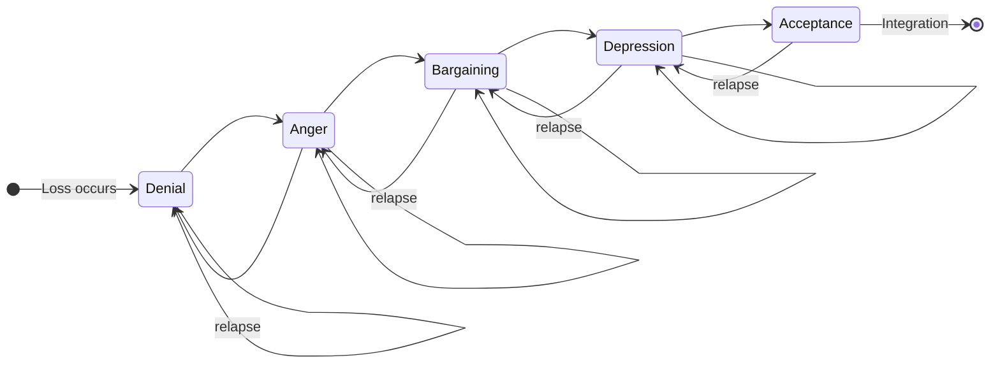
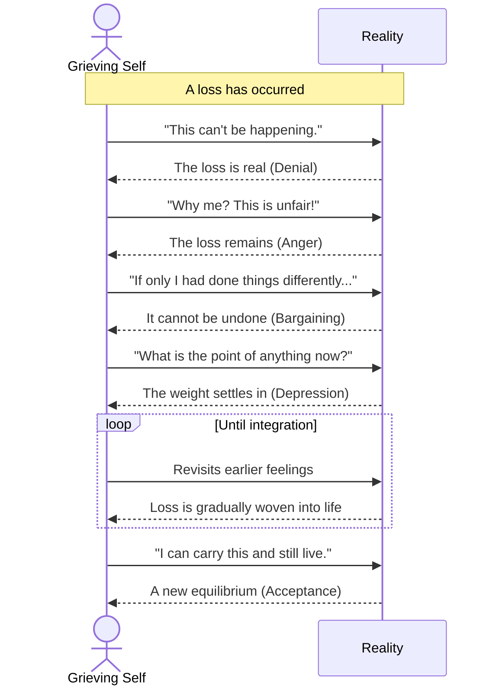

# The Science of Broken Hearts

A "broken heart" is more than a poetic metaphor. Emotional loss — bereavement, romantic rejection, divorce — sets off a measurable cascade of neuroendocrine and cardiovascular events. In rare cases it produces a genuine, imaging-confirmed cardiac syndrome. This report surveys what physiology, neuroscience, and clinical cardiology have established about heartbreak, and traces two of its core processes: the acute stress response and the staged psychological course of grief.

## The Body's Acute Response to Loss

Heartbreak begins in the brain. The perception of social rejection or loss activates many of the same regions implicated in physical pain — the dorsal anterior cingulate cortex and the anterior insula — which is why grief is so often described in bodily terms. This perception feeds directly into the body's central stress circuitry.

### The Two Stress Axes

The acute response runs along two coupled pathways:

- **The sympathetic-adrenal-medullary (SAM) axis** fires within seconds, flooding the bloodstream with adrenaline and noradrenaline. Heart rate climbs, blood pressure rises, and the body braces.
- **The hypothalamic-pituitary-adrenal (HPA) axis** follows over minutes, releasing cortisol that sustains the alert state and mobilizes energy.

Under normal circumstances a negative-feedback loop returns the system to baseline once the threat passes. In prolonged grief, repeated or unrelenting activation keeps this loop from closing.

### Mapping the Stages of Grief

The state diagram below models the five Kübler-Ross stages as a state machine. Crucially, the transitions are not a one-way staircase: a griever can move forward, slip back to an earlier state, or loop within a stage before any of them finally resolves into acceptance and integration.

### Takotsubo Cardiomyopathy

When the catecholamine surge is extreme, it can transiently stun the heart muscle. The left ventricle balloons at the apex while the base contracts normally, producing a shape resembling the Japanese *takotsubo* octopus-trapping pot — hence the name. Patients present with chest pain and ECG changes that mimic a heart attack, yet their coronary arteries are typically clear. The syndrome overwhelmingly affects post-menopausal women and is most often triggered by acute emotional shock, which earned it the popular label "broken heart syndrome." Most patients recover full cardiac function within weeks, but the acute phase carries real mortality risk.

## The Psychological Course of Grief

Where the stress response unfolds in seconds and minutes, the psychological work of grief unfolds over weeks and months. The most familiar framework is the five-stage model introduced by Elisabeth Kübler-Ross — denial, anger, bargaining, depression, and acceptance.

### Stages Are Not a Staircase

A crucial caveat: these stages are not linear, universal, or obligatory. Kübler-Ross herself emphasized that people move among them in any order, revisit earlier states, and may skip some entirely. The model is best read as a vocabulary for common emotional textures, not a schedule a griever must follow.

### The Inner Dialogue of Grief

The sequence diagram below renders the five stages as an interaction between the grieving self and reality — the back-and-forth of a mind negotiating with an unchangeable loss. The loop captures how grievers cycle between stages rather than progressing cleanly.

### When Grief Becomes Disorder

For most people, acute grief softens into integrated grief over six to twelve months. But in roughly one in ten bereaved adults, the acute state persists — a condition now recognized in diagnostic manuals as **prolonged grief disorder**. It is marked by intense yearning, preoccupation with the deceased, and difficulty re-engaging with life beyond the expected cultural window. Recognizing it as a distinct, treatable condition has opened the door to targeted therapies rather than simply "waiting it out."

## Why Connection Is Wired So Deep

The intensity of heartbreak reflects how thoroughly the human nervous system is built for attachment. Social bonds were, for our ancestors, a survival resource — and the brain treats their loss with the same alarm circuitry it reserves for physical danger. Grief, in this light, is the cost of having loved; the same systems that make connection feel rewarding make its rupture feel like injury.

## Key Takeaways

- Heartbreak engages the brain's physical-pain and threat-detection systems, driving a real neuroendocrine stress cascade along the SAM and HPA axes.
- In extreme cases an acute catecholamine surge can stun the heart, producing Takotsubo (broken heart) cardiomyopathy — usually reversible but clinically serious.
- The five-stage grief model is a useful vocabulary, not a fixed sequence; people cycle among stages on the way to integration.
- Persistent acute grief beyond the expected window is now recognized as prolonged grief disorder, a distinct and treatable condition.
